[TOC]


## 注意

- 贴代码的地方基本上只需要关注有注释的地方即可，没注释的地方，一般是涉及到对应框架的具体语法，考的可能性应该不大（考到了只能说出题的老师牛逼）
- 非代码的部分应该是考试重点，需要认真看（也就是各个小标题、列出的点之类的需要认真看，下面贴的代码用于帮助理解）


## 第1节 搭建开发、运行、自动化测试环境

### Spring框架的特点或能力

- 轻量级（Lightweight）——相对于EJB
- 非侵入性（No intrusive） ——不一定要实现Spring的接口，编程时可以当这个框架不存在
-  容器（Container） ——管理java对象的容器（管理对象的生命周期、对象之间的依赖关系）
-  **依赖注入(Dependency Injection)** ——Spring帮忙创建对象和建立对象之间的依赖关系
-  **面向切面编程(Aspect Oriented Programming)** ——在横切关注面上增加功能，最为面向对象的补充
-  持久层（JDBC封装、事务管理、ORM工具整合） 
-  Web框架（MVC、其它WEB框架整合） 
-  其他企业服务的封装

### Spring的模块组成


### 基于spring的典型web分层架构示例


servlet承担两个责任

- 将请求转发到控制器
- 将控制器传过来的model和view组装成html

### 代码讲解

#### 主要目录结构

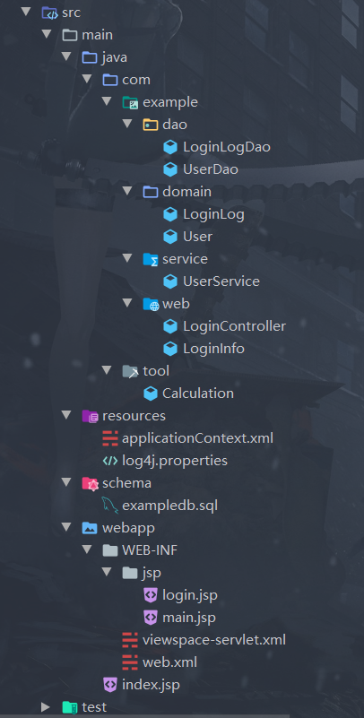

#### 配置 [^1]

以下内容可以对照

[^2]: 应用的java配置方式


- web.xml


- viewspace-servlet.xml


- applicationContext.xml


jdbcTemplate通过xml配置初始化，dao层中使用autowired注解将其注入，jdbc模板大大简化了jdbc操作


通过AOP技术，将事务管理器横切进service层


#### 从输入URL到看到结果

- 以jsp为例

输入根路径 -> servlet 返回index.jsp渲染的结果 

前端跳转到某路径 -> servlet将路径映射到对应的controller（通过RequestMapping注解） -> controller 调用service层业务逻辑，将数据储存在request.session中，并且返回视图名 -> servlet将对应视图和数据组装好返回给用户 -> 用户看到渲染后的页面

#### 构建与部署 

- 通常在开发时可以用**jetty**插件简化构建过程

1. 打包

```bash
mvn clean package #清空、重新编译打包(war)
```

2. 将war包扔到tomcat/webapps目录下，运行tomcat

#### 单元测试

##### junit 略

##### mockito 

- mock的两种方式
  - 
  - 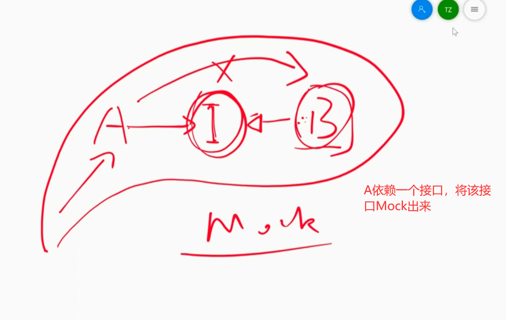
- mockito具体代码参见section1 > test

##### 构建测试环境的几种方式

- MockMvc配合mockito等构建上下文

```java
@Test
    public void loginFail() throws Exception {
        UserService userService = mock(UserService.class);
        when(userService.hasMatchUser("test", "123456")).thenReturn(false);

        LoginController controller = new LoginController(userService);
        MockMvc mockMvc = standaloneSetup(controller).build();
        mockMvc.perform(post("/admin/loginCheck.html")
                .param("userName", "test")
                .param("password", "123456"))
                .andExpect(view().name("login"))
                .andExpect(model().attributeExists("error"));

        verify(userService).hasMatchUser("test", "123456");
    }
```

- `@ContextConfiguration(locations = {"classpath:META-INF/spring/soundsystem.xml"})` resource下的资源打包后在classpath的根路径位置

  `@ContextConfiguration(classes = {CDPlayerConfig.class})`

  在Test类上加上`ContextConfiguration`注解构建上下文


## 第2节 依赖注入（Dependency Injection）

### 三种不同层次的容器

层次由低到高——

- Docker容器
  - 类似虚拟机

- web容器
  - 如tomcat\jetty等，用来运行web应用的地方
- Spring容器
  - spring框架中用来管理java对象生命周期、管理对象之间依赖关系的容器

### Spring配置

#### 两种组件扫描


- 在需要被Spring管理的类上面标记`@Component`

##### java扫描

- @Configuration表示这是一个配置文件
- @ComponentScan不带参数表示在当前包下扫描，也可以带参数

```java
@Configuration /*java配置类*/
@ComponentScan /*在当前包（可以指定包名）下寻找加了component注解的类并实例化它们*/
//@ComponentScan(basePackageClasses = {Mark.class})  /*类型安全、Marker Interface*/ 
//简写为 @ComponentScan(basePackageClasses = Mark.class)

//@ComponentScan(basePackages = {"com.abc"}) /*类型不安全（字符串容易敲错）*/
//简写为 @ComponentScan("com.abc")
public class CDPlayerConfig {
}
```

- Marker  Interface如图所示，该接口仅用来标记这个包，无其他含义


##### xml扫描

```xml
<context:component-scan base-package="soundsystem" />
```

##### 构建Spring容器

```java
ApplicationContext ctx = new AnnotationConfigApplicationContext(CDPlayerConfig.class); //对应java扫描
```

```java
ApplicationContext ctx = new ClassPathXmlApplicationContext("META-INF/spring/soundsystem.xml"); //对应xml扫描
```


#### 三种配置方案


##### 自动化配置

- 在需要被管理的类名上面加上@Component注解


​			Autowired也可以直接写在属性上

##### JavaConfig

```java
@Configuration
public class CDPlayerConfig {

    @Bean
//    @Scope(ConfigurableBeanFactory.SCOPE_PROTOTYPE) // 每次都会创建实例
    public CompactDisc compactDisc() {
        return new SgtPeppers();
    }

    @Bean
    public CDPlayer cdPlayer(CompactDisc compactDisc) { /*依赖注入*/
        return new CDPlayer(compactDisc);
    }

    @Bean(name = {"cd2","CD2"})
    public CDPlayer cdPlayer2() { /*用函数来获取disc对象*/
        return new CDPlayer(compactDisc());
    }

}
```

##### XML配置


- CNamespaceReferenceTest-context

```xml
<beans ...>

  <bean id="compactDisc" class="soundsystem.SgtPeppers" />
        
  <bean id="cdPlayer" class="soundsystem.CDPlayer"
        c:cd-ref="compactDisc" />  <!-- c命名空间,用名为compactDisk的实例来注入名为cd的参数(不推荐) -->
</beans>
```

- CNamespaceValueTest-context

```xml
<beans ...>

  <bean id="compactDisc" class="soundsystem.BlankDisc"
        c:_0="Sgt. Pepper's Lonely Hearts Club Band" 
        c:_1="The Beatles" />
        
  <bean id="cdPlayer" class="soundsystem.CDPlayer"
        c:_0-ref="compactDisc" /> <!--只有一个参数就可以省略_0-->

</beans>
```

- ConstructorArgCollectionTest-context

```xml
<beans ...>
    
  <bean id="compactDisc" class="soundsystem.collections.BlankDisc">
    <constructor-arg value="Sgt. Pepper's Lonely Hearts Club Band" />
    <constructor-arg value="The Beatles" />
    <constructor-arg>
      <list>
        <value>Sgt. Pepper's Lonely Hearts Club Band</value>
        <value>With a Little Help from My Friends</value>
        <value>Lucy in the Sky with Diamonds</value>
        <value>Getting Better</value>
        <value>Fixing a Hole</value>
        <value>She's Leaving Home</value>
        <value>Being for the Benefit of Mr. Kite!</value>
        <value>Within You Without You</value>
        <value>When I'm Sixty-Four</value>
        <value>Lovely Rita</value>
        <value>Good Morning Good Morning</value>
        <value>Sgt. Pepper's Lonely Hearts Club Band (Reprise)</value>
        <value>A Day in the Life</value>
      </list>
    </constructor-arg>
  </bean>
        
  <bean id="cdPlayer" class="soundsystem.CDPlayer">
    <constructor-arg ref="compactDisc" />
  </bean>

</beans>

```

- ConstructorArgReferenceTest-context

```xml
<beans ...>

  <bean id="compactDisc" class="soundsystem.SgtPeppers" />
        
  <bean id="cdPlayer" class="soundsystem.CDPlayer">
    <constructor-arg ref="compactDisc" />
  </bean>

</beans>
```

- ConstructorArgValueTest-context

```xml
<beans ...>

  <bean id="compactDisc"
        class="soundsystem.BlankDisc">
    <constructor-arg value="Sgt. Pepper's Lonely Hearts Club Band" />
    <constructor-arg value="The Beatles" />
  </bean>
        
  <bean id="cdPlayer"
        class="soundsystem.CDPlayer">
    <constructor-arg ref="compactDisc" />
  </bean>

</beans>
```

- PNamespaceRefTest-context

```xml
<?xml version="1.0" encoding="UTF-8"?>
<beans ...>

  <bean id="compactDisc" class="soundsystem.BlankDisc">
    <constructor-arg value="Sgt. Pepper's Lonely Hearts Club Band" />
    <constructor-arg value="The Beatles" />
  </bean>
        
  <bean id="cdPlayer" class="soundsystem.properties.CDPlayer">
    <property name="compactDisc" ref="compactDisc" />
  </bean>

</beans>

```

- PNamespaceValueTest-context

```xml
<?xml version="1.0" encoding="UTF-8"?>
<beans ...>

  <bean id="compactDisc"
        class="soundsystem.properties.BlankDisc"
        p:title="Sgt. Pepper's Lonely Hearts Club Band"
        p:artist="The Beatles">
    <property name="tracks">  <!--p(property)命名空间不支持集合-->
      <list>
        <value>Sgt. Pepper's Lonely Hearts Club Band</value>
        <value>With a Little Help from My Friends</value>
        <value>Lucy in the Sky with Diamonds</value>
        <value>Getting Better</value>
        <value>Fixing a Hole</value>
        <value>She's Leaving Home</value>
        <value>Being for the Benefit of Mr. Kite!</value>
        <value>Within You Without You</value>
        <value>When I'm Sixty-Four</value>
        <value>Lovely Rita</value>
        <value>Good Morning Good Morning</value>
        <value>Sgt. Pepper's Lonely Hearts Club Band (Reprise)</value>
        <value>A Day in the Life</value>
      </list>
    </property>
  </bean>
        
  <bean id="cdPlayer"
        class="soundsystem.properties.CDPlayer"
        p:compactDisc-ref="compactDisc" />

</beans>

```

- PNamespaceWithUtilNamespaceTest-context

```xml
<?xml version="1.0" encoding="UTF-8"?>
<beans ...>

  <bean id="compactDisc"
        class="soundsystem.properties.BlankDisc"
        p:title="Sgt. Pepper's Lonely Hearts Club Band"
        p:artist="The Beatles"
        p:tracks-ref="trackList" />

  <util:list id="trackList">  
    <value>Sgt. Pepper's Lonely Hearts Club Band</value>
    <value>With a Little Help from My Friends</value>
    <value>Lucy in the Sky with Diamonds</value>
      ...
  </util:list>

  <bean id="cdPlayer"
        class="soundsystem.properties.CDPlayer"
        p:compactDisc-ref="compactDisc" />

</beans>

```

- PropertyRefTest-context

```xml
<?xml version="1.0" encoding="UTF-8"?>
<beans ...>

  <bean id="compactDisc" class="soundsystem.BlankDisc">
    <constructor-arg value="Sgt. Pepper's Lonely Hearts Club Band" />
    <constructor-arg value="The Beatles" />
  </bean>
        
  <bean id="cdPlayer" class="soundsystem.properties.CDPlayer"
        p:compactDisc-ref="compactDisc" />

</beans>

```

- PropertyValueTest-context

```xml
<?xml version="1.0" encoding="UTF-8"?>
<beans ...>

  <bean id="compactDisc"
        class="soundsystem.properties.BlankDisc">
    <property name="title" value="Sgt. Pepper's Lonely Hearts Club Band" />
    <property name="artist" value="The Beatles" />
    <property name="tracks">
      <list>
        <value>Sgt. Pepper's Lonely Hearts Club Band</value>
        <value>With a Little Help from My Friends</value>
        <value>Lucy in the Sky with Diamonds</value>
          ...
      </list>
    </property>
  </bean>
        
  <bean id="cdPlayer"
        class="soundsystem.properties.CDPlayer"
        p:compactDisc-ref="compactDisc" />

</beans>

```

##### 混合配置


##### 根配置


#### 其他

- 可以给Component指定名字,`@Component(Value = "XXX")`
- `StandardOutputStreamLog`  获取控制台输出
- `System.getProperty("line.separater") ` 获取系统换行符
- Bean实现接口 `BeanNameAware` 以后，可以在setNeanName方法里面获取到bean的名字


## 第3节 面向切面编程 （AOP）

### 软件编程方法的发展


### 横切关注点

- 横向切到业务代码里面的一段逻辑或者模块

- 如日志、安全、事务和缓存等等


### AOP术语


- 下述定义存疑【下述定义是百度到的定义，和老师讲的恰好相反，我觉得应该是老师讲错了。。】

>  1.连接点（Join point）：连接点是在应用执行过程中能够插入切面（Aspect）的一个点。这些点可以是调用方法时、甚至修改一个字段时。
>
> 2.切点（Pointcut）：切点是指通知（Advice）所要织入（Weaving）的具体位置。

### 通知类型


### 织入时机


- 其中，编译器和类加载期织入需要编译器的支持，Spring只支持运行期织入

### 代码一览

#### 两种配置文件

##### 注解形式

```java
@Configuration
@EnableAspectJAutoProxy //开启AspectJ的自动代理机制
@ComponentScan
public class ConcertConfig {
    @Bean
    public Audience2 audience() { //要织入的代码
        return new Audience2();
    }

    @Bean
    public Performance concert() { //被织入的代码
        return new Concert();
    }

    @Bean
    public EncoreableIntroducer encoreableIntroducer() { //要增加的方法实例
        return new EncoreableIntroducer();
    }
}
```

##### XML形式

```xml
<aop:aspectj-autoproxy/>
<bean class="concert.Audience"/>
<bean id="concert" class="concert.Concert"/>
```


#### 注解驱动的切面(Java)

##### 普通切面

```java
@Aspect
public class Audience {
    @Before("execution(* concert.Performance.perform( .. ))")
    public void silenceCellPhones() {
        System.out.println("Silencing cell phones");
    }

    @Before("execution(* concert.Performance.perform( .. ))")
    public void takeSeats() {
        System.out.println("Taking seats");
    }

    @AfterReturning("execution(* concert.Performance.perform( .. ))")
    public void applause() {
        System.out.println("CLAP CLAP CLAP!!!");
    }

    @AfterThrowing("execution(* concert.Performance.perform( .. ))")
    public void demandRefund() {
        System.out.println("Demand a refund");
    }
}
```

##### 提取了pointcut的切面

```java
@Aspect
public class Audience1 {
    @Pointcut("execution(* concert.Performance.perform( .. ))")
    public void performance() {
    }

    @Before("performance()")
    public void silenceCellPhones() {
        System.out.println("Silencing cell phones");
    }
}
```

##### @Around 标签

```java
@Aspect
public class Audience2 {
    @Pointcut("execution(* concert.Performance.perform( .. ))")
    public void performance() {
    }

    @Around("performance()")  /* 包围 */
    public void watchPerformance(ProceedingJoinPoint joinPoint) {
        try {
            System.out.println(".Silencing cell phones");
            System.out.println(".Taking seats");
            joinPoint.proceed();  // 方法调用(可以调用多次)
            System.out.println(".CLAP CLAP CLAP!!!");
        } catch (Throwable e) {
            System.out.println(".Demanding a refund");
        }
    }
}
```

##### 给类增添接口

```java
public interface Encoreable { //接口
    void performEncore();
}
=======================
public class DefaultEncoreable implements Encoreable { //实例
    public void performEncore() {
        System.out.println("perform the encore!");
    }
}   
=======================
@Aspect
public class EncoreableIntroducer { 
    @DeclareParents(value = "concert.Performance+", //要增加接口的类
            defaultImpl = DefaultEncoreable.class) //要增加的接口的实例
    public static Encoreable encoreable; //增加的接口
}
```

##### 给带参数的方法增加切面

```java
//需要增加切面的方法
public interface CompactDisc {
    void playTrack(int num);
}

====================================
//切面
@Aspect
public class TrackCounter {
    private Map<Integer, Integer> trackCounts = new HashMap<Integer, Integer>();

    @Pointcut(
            "execution(* soundsystem.CompactDisc.playTrack( int )) " +
                    "&& args(trackNumber)") //这一行很关键
    public void trackPlayed(int trackNumber) {
    }

    @Before("trackPlayed(trackNumber)")
    public void countTrack(int trackNumber) {
        int currentCount = getPlayCount(trackNumber);
        trackCounts.put(trackNumber, currentCount + 1);
    }

    public int getPlayCount(int trackNumber) {
        return trackCounts.containsKey(trackNumber) ? trackCounts.get(trackNumber) : 0;
    }
}
```


#### 纯POJO切面（XML）

##### 普通切面

```xml
<aop:aspectj-autoproxy/>

<bean id="audience" class="concert2.Audience"/>
<bean id="concert" class="concert.Concert"/>

<aop:config>
    <aop:aspect ref="audience">
        <aop:before method="silenceCellPhones"
                    pointcut="execution(* concert.Performance.perform(..))"/>
        <aop:before method="takeSeats"
                    pointcut="execution(* concert.Performance.perform(..))"/>
        <aop:after method="applause"
                   pointcut="execution(* concert.Performance.perform(..))"/>
        <aop:after-throwing method="demandRefund"
                            pointcut="execution(* concert.Performance.perform(..))"/>
    </aop:aspect>
</aop:config>
```

##### 提取了pointcut的切面

```xml
<aop:aspectj-autoproxy/>

    <bean id="audience" class="concert2.Audience"/>
    <bean id="concert" class="concert.Concert"/>

    <aop:config>
        <aop:aspect ref="audience">
            <aop:pointcut id="performance"
                          expression="execution(* concert.Performance.perform(..))"/>

            <aop:before method="silenceCellPhones"
                        pointcut-ref="performance"/>

            <aop:before method="takeSeats"
                        pointcut-ref="performance"/>

            <aop:after method="applause"
                       pointcut-ref="performance"/>

            <aop:after-throwing method="demandRefund"
                                pointcut-ref="performance"/>
        </aop:aspect>
    </aop:config>
```

##### around

```xml
<aop:aspectj-autoproxy/>

<bean id="audience" class="concert2.Audience2"/>
<bean id="concert" class="concert.Concert"/>

<aop:config>
    <aop:aspect ref="audience">
        <aop:pointcut id="performance"
                      expression="execution(* concert.Performance.perform(..))"/>

        <!--其实跟其他几个写法一模一样，只是具体方法需要携带 ProceedingJoinPoint类型的参数-->
        <aop:around method="watchPerformance"
                    pointcut-ref="performance"/>
    </aop:aspect>
</aop:config>
```

##### 给类增添接口

```xml
<aop:aspectj-autoproxy/>

<bean id="concert" class="concert.Concert"/>

<aop:config>
    <aop:aspect>
        <aop:declare-parents types-matching="concert.Performance+"
                             implement-interface="concert.Encoreable"
                             default-impl="concert.DefaultEncoreable"/>
        <!--DefaultEncoreable不需要实例化-->
    </aop:aspect>
</aop:config>
```

##### 给带参数的方法增加切面

```xml
<aop:aspectj-autoproxy/>

<bean id="trackCounter" class="soundsystem2.TrackCounter"/>
<bean id="cd" class="soundsystem.BlankDisc">
    ...
</bean>

<aop:config>
    <aop:aspect ref="trackCounter">
        <aop:pointcut id="trackPlayed"
                      expression="execution(* soundsystem.CompactDisc.playTrack(int)) and args(trackNumber)"/>

        <aop:before method="countTrack"
                    pointcut-ref="trackPlayed"/>
    </aop:aspect>
</aop:config>
```


## 第4节 Web开发框架（MVC、控制器、视图渲染）

### 软件体系架构（C/S,B/S）


### 服务端开发的一般架构


### 追踪SpringMVC的请求


### DispatchServlet配置[^2]

- 以下内容建议对照

  [^1]: 应用的XML配置


想了半天，发现这个的意思是 : `AbstractAnnotationConfigDispatcherServletInitializer` 这个类使用了两个类——`ContextLoaderListener` 和 `DispatcherServlet` , 在Servlet3之前，这两个类就存在了，但是是在web.xml里面配置的，具体配置如下( section1的web.xml )

```xml
<?xml version="1.0" encoding="UTF-8"?>
<web-app version="2.5"
         xmlns="http://java.sun.com/xml/ns/javaee"
         xmlns:xsi="http://www.w3.org/2001/XMLSchema-instance"
         xsi:schemaLocation="http://java.sun.com/xml/ns/javaee
	http://java.sun.com/xml/ns/javaee/web-app_2_5.xsd">
<!--    配置上下文-->
    <context-param>
        <param-name>contextConfigLocation</param-name>
        <param-value>classpath:applicationContext.xml</param-value>
    </context-param>
    <listener>
        <listener-class>
            org.springframework.web.context.ContextLoaderListener
        </listener-class>
    </listener>

<!--    配置servlet-->
    <servlet>
        <servlet-name>viewspace</servlet-name>
        <servlet-class>
            org.springframework.web.servlet.DispatcherServlet
        </servlet-class>
        <load-on-startup>3</load-on-startup>
    </servlet>

    <servlet-mapping>
        <servlet-name>viewspace</servlet-name>
        <url-pattern>*.html</url-pattern>
    </servlet-mapping>
</web-app>
```

而现在只需要像下面这么写

```java
import org.springframework.web.servlet.support.AbstractAnnotationConfigDispatcherServletInitializer;
import example.web.WebConfig;

public class AddressBookWebInitializer extends AbstractAnnotationConfigDispatcherServletInitializer {

    @Override
    protected Class<?>[] getRootConfigClasses() {
        return new Class<?>[]{RootConfig.class}; //上下文配置
    }

    @Override
    protected Class<?>[] getServletConfigClasses() { //servlet配置
        return new Class<?>[]{WebConfig.class};
    }

    @Override
    protected String[] getServletMappings() {
        return new String[]{"/"};
    }
}
```

其中，RootConfig.java如下

```java
@Configuration
@Import(DataConfig.class) //导入数据源的配置
@ComponentScan(basePackages = {"example"}, //实例化example下面的Component
        excludeFilters = {
                @Filter(type = FilterType.CUSTOM, value = WebPackage.class) //不实例化web包下面的Component
        })
public class RootConfig {
    public static class WebPackage extends RegexPatternTypeFilter {
        public WebPackage() {
            super(Pattern.compile("example\\.web"));
        }
    }
}
```

DataConfig.java如下

```java
@Configuration
public class DataConfig {

    @Bean
    public DataSource dataSource() {
        return new EmbeddedDatabaseBuilder()
                .setType(EmbeddedDatabaseType.H2) //H2，一般用来做测试用
                .addScript("schema.sql")
                .build();
    }

    @Bean
    public JdbcOperations jdbcTemplate(DataSource dataSource) {
        return new JdbcTemplate(dataSource);
    }

}
```


WebConfig.java如下

```java
@Configuration
@EnableWebMvc //允许使用MVC组件
@ComponentScan("example.web") //组件扫描，实例化Controller类
public class WebConfig extends WebMvcConfigurerAdapter {

    @Bean
    public ViewResolver viewResolver() { //配置视图解析器
        InternalResourceViewResolver resolver = new InternalResourceViewResolver();
        resolver.setPrefix("/WEB-INF/views/");
        resolver.setSuffix(".jsp");
        return resolver;
    }

    @Override /** 默认静态资源处理器（不考） **/
    public void configureDefaultServletHandling(DefaultServletHandlerConfigurer configurer) {
        configurer.enable();
    }

    @Override /** 静态资源处理（不考） **/
    public void addResourceHandlers(ResourceHandlerRegistry registry) {
        // TODO Auto-generated method stub
        super.addResourceHandlers(registry);
    }

}
```

`WebMvcConfigurerAdapter` 这个类可以解决跨域问题、添加拦截器、配置视图解析器、静态资源处理等等，有些许的复杂，老师也没讲过这个，并且Spring5.0已经废弃该类，因此我认为他不会考。。

“排除静态资源请求” 是啥意思我不太清楚，我猜测指的是静态资源处理。

### 控制器（Controller）的实现

```java
@Controller //实际上等价于@Component
@RequestMapping("/person")
public class PersonController {

    private static final String MAX_LONG_AS_STRING = "9223372036854775807";

    private PersonRepository personRepository;

    @Autowired
    public PersonController(PersonRepository personRepository) { //构造器注入，另外这个构造函数在Controller测试时会使用到，那时候会传入一个MockRepository
        this.personRepository = personRepository;
    }

    /* 请求参数（带默认值）、model */
    @RequestMapping(value = "/list", method = RequestMethod.GET)
    public String persons(
            @RequestParam(value = "max", defaultValue = MAX_LONG_AS_STRING) long max, Model model) {
        model.addAttribute(personRepository.findPersons(max));//省去了第一个参数“personList”
        return "list"; //返回视图名
    }

    /* 路径参数 */
    @RequestMapping(value = "/{name}", method = RequestMethod.GET)
    public String person(
            @PathVariable("name") String name,//同名时，value可以去除
            Model model) {
        model.addAttribute(personRepository.findByName(name));
        return "person";
    }

    /* 空的表单 */
    @RequestMapping(value = "/add", method = GET)
    public String showRegistrationForm(Model model) {
        model.addAttribute(new Person()); //空的Person，在视图上显示为空字段
        return "personForm";
    }

    /* 表单参数，字段验证 */
    @RequestMapping(value = "/add", method = RequestMethod.POST)
    public String savePerson(@Valid Person person, Errors errors) throws Exception {
        //这里表单提交时需要提交的form字段和Person的字段保持一致（默认处理），不一致可能需要其他操作
        if (errors.hasErrors()) { //验证出错会接收到Errors（怎么接收到的不太清楚）
            return "personForm";
        }
        personRepository.save(person);
        return "redirect:/person/list"; //重定向
    }
	
    ...

}

```

表单校验需要在**需要校验的类**上面添加@NotNull、@Size等校验标签，并且在控制器传参的位置加上@Valid标签。有一些error信息需要写到 `resources/ValidationMessages.properties` 当中。

- Person.java

```java
public class Person {

    private Long id;

    @NotNull
    @Size(min = 5, max = 20,message="{name.size}")
    private String name;

    @NotNull
    @Size(min = 2, max = 100,message="{address.size}")
    private String address;
 	
    ...

}
```

- resources/ValidationMessages.properties

```properties
name.size=name must be between {min} and {max} characters long.
address.size=address must be between {min} and {max} characters long.
zipCode.size=zipCode must be between {min} and {max} characters long.
phone.size=phone must be between {min} and {max} characters long.
```


### 控制器（Controller）的测试

测试这玩意儿看起来很玄妙，不过大体的步骤如下

- mock 一下dao层
- new出一个Controller
- 通过该Controller建立MockMvc
- MockMvc模拟请求，传入请求参数
- MockMvc验证一下Controller返回的视图对不对、有没有重定向、得到的model数据对不对等等
- 也可以验证一下Controller层有没有调用到dao层

代码如下，自己品。。

```java
package example.web;

import org.junit.Test;
import org.springframework.test.web.servlet.MockMvc;
import org.springframework.web.servlet.view.InternalResourceView;
import example.Person;
import example.data.PersonRepository;

import java.util.ArrayList;
import java.util.List;

import static org.hamcrest.Matchers.hasItems;
import static org.mockito.Mockito.*;
import static org.springframework.test.web.servlet.request.MockMvcRequestBuilders.get;
import static org.springframework.test.web.servlet.request.MockMvcRequestBuilders.post;
import static org.springframework.test.web.servlet.result.MockMvcResultMatchers.*;
import static org.springframework.test.web.servlet.setup.MockMvcBuilders.standaloneSetup;

public class PersonControllerTest {

    @Test
    public void shouldShowAllPersons() throws Exception {
        List<Person> expectedPersons = createPersonList(20);
        PersonRepository mockRepository = mock(PersonRepository.class);
        when(mockRepository.findPersons(Long.MAX_VALUE))
                .thenReturn(expectedPersons);

        PersonController controller = new PersonController(mockRepository);
        MockMvc mockMvc = standaloneSetup(controller)
                .setSingleView(new InternalResourceView("/WEB-INF/views/list.jsp"))
                .build();

        mockMvc.perform(get("/person/list"))
                .andExpect(view().name("list"))
                .andExpect(model().attributeExists("personList"))
                .andExpect(model().attribute("personList",
                        hasItems(expectedPersons.toArray())));
    }

    @Test
    public void shouldShowFilterPersons() throws Exception {
        List<Person> expectedPersons = createPersonList(50);
        PersonRepository mockRepository = mock(PersonRepository.class);
        when(mockRepository.findPersons(50))
                .thenReturn(expectedPersons);

        PersonController controller = new PersonController(mockRepository);
        MockMvc mockMvc = standaloneSetup(controller)
                .setSingleView(new InternalResourceView("/WEB-INF/views/list.jsp"))
                .build();

        mockMvc.perform(get("/person/list?max=50"))
                .andExpect(view().name("list"))
                .andExpect(model().attributeExists("personList"))
                .andExpect(model().attribute("personList",
                        hasItems(expectedPersons.toArray())));
    }

    @Test
    public void testPerson() throws Exception {
        Person expectedPerson = new Person("Name", "abc", "111111", "77777777777");
        PersonRepository mockRepository = mock(PersonRepository.class);
        when(mockRepository.findByName("zhangsan")).thenReturn(expectedPerson);

        PersonController controller = new PersonController(mockRepository);
        MockMvc mockMvc = standaloneSetup(controller).build();

        mockMvc.perform(get("/person/zhangsan"))
                .andExpect(view().name("person"))
                .andExpect(model().attributeExists("person"))
                .andExpect(model().attribute("person", expectedPerson));
    }

    @Test
    public void addPerson() throws Exception {
        PersonRepository mockRepository = mock(PersonRepository.class);
        PersonController controller = new PersonController(mockRepository);
        MockMvc mockMvc = standaloneSetup(controller).build();

        mockMvc.perform(post("/person/add")
                .param("name", "name123")
                .param("address", "this is address")
                .param("zipCode", "123456")
                .param("phone", "12345678900"))
                .andExpect(redirectedUrl("/person/list"));

        verify(mockRepository, atLeastOnce()).save(new Person("name123", "this is address", "123456", "12345678900"));
    }

    private List<Person> createPersonList(int count) {
        List<Person> persons = new ArrayList<>();
        for (int i = 0; i < count; i++) {
            persons.add(new Person("Person " + i, "abcdefghijiadiididid", "212001", "13377777777"));
        }
        return persons;
    }
}

```


## 第5节 Spring Web Flow

### Servlet简单介绍

#### servlet配置

```xml
<?xml version="1.0" encoding="UTF-8"?>
<web-app xmlns="http://xmlns.jcp.org/xml/ns/javaee"
         xmlns:xsi="http://www.w3.org/2001/XMLSchema-instance"
         xsi:schemaLocation="http://xmlns.jcp.org/xml/ns/javaee
                http://xmlns.jcp.org/xml/ns/javaee/web-app_3_1.xsd"
         version="3.1">
    <!--   实现servlet -->
    <display-name>hello</display-name>

    <!-- servlet部署 -->
    <servlet>
        <!--给servlet取名，任意 -->
        <servlet-name>hello1</servlet-name>
        <!-- 指明servlet路径，包名.类名 -->
        <servlet-class>example.MyServlet1</servlet-class>
    </servlet>

    <servlet-mapping>
        <!--servlet映射，必须与servlet-name同名 -->
        <servlet-name>hello1</servlet-name>
        <!--这是浏览器中输入的访问该servlet的url-->
        <url-pattern>/s1</url-pattern>
    </servlet-mapping>

    <!--指定为哪些url配置过滤器-->
    <filter>
        <filter-name>MyFilter</filter-name>
        <filter-class>example.MyFilter</filter-class>
    </filter>
    <filter-mapping>
        <filter-name>MyFilter</filter-name>
        <url-pattern>/*</url-pattern>
    </filter-mapping>
</web-app>


```

#### Servlet 代码

##### 最原始版本

```java
package example;

import java.io.IOException;
import java.io.PrintWriter;

import javax.servlet.Servlet;
import javax.servlet.ServletConfig;
import javax.servlet.ServletException;
import javax.servlet.ServletRequest;
import javax.servlet.ServletResponse;

public class MyServlet1 implements Servlet { //实现servlet接口

    @Override
    public void destroy() {
        System.out.println("destroy");
    }

    @Override
    public ServletConfig getServletConfig() {
        return null;
    }

    @Override
    public String getServletInfo() {
        return null;
    }

    @Override
    public void init(ServletConfig arg0) throws ServletException {
        System.out.println("init it in servlet");
    }

    @Override
    public void service(ServletRequest request, ServletResponse response) throws ServletException, IOException {
        System.out.println("service1...");

        //打印在浏览器上
        PrintWriter pw = response.getWriter();
        pw.println("hello,this is servlet1");
    }

}

```

##### 进行了简单封装

```java
package example;

import javax.servlet.GenericServlet;
import javax.servlet.ServletException;
import javax.servlet.ServletRequest;
import javax.servlet.ServletResponse;
import java.io.IOException;
import java.io.PrintWriter;


public class MyServlet2 extends GenericServlet { //继承GenericServlet，其对Servlet接口进行了简单实现，因此不用再写一堆override

    @Override
    public void service(ServletRequest request, ServletResponse response) throws ServletException, IOException {
        System.out.println("service2...");
        PrintWriter pw = response.getWriter();
        pw.println("hello,this is a GenericServlet");
    }
}

```

##### 实现了http协议

```java
package example;

import java.io.IOException;
import java.io.PrintWriter;

import javax.servlet.ServletException;
//import javax.servlet.annotation.WebServlet;
import javax.servlet.http.HttpServlet;
import javax.servlet.http.HttpServletRequest;
import javax.servlet.http.HttpServletResponse;

//@WebServlet("/s3")
public class MyServlet3 extends HttpServlet { //进一步实现了http协议
    private static final long serialVersionUID = 1L;

    public MyServlet3() {
        super();
    }

    //处理get请求
    protected void doGet(HttpServletRequest request, HttpServletResponse response) throws ServletException, IOException {
        PrintWriter pw = response.getWriter();
        pw.println("hello,this is a HttpServlet");
    }

    //处理post请求
    protected void doPost(HttpServletRequest request, HttpServletResponse response) throws ServletException, IOException {
        doGet(request, response);
    }

}

```

##### filter代码

```java
package example;

import java.io.IOException;

import javax.servlet.Filter;
import javax.servlet.FilterChain;
import javax.servlet.FilterConfig;
import javax.servlet.ServletException;
import javax.servlet.ServletRequest;
import javax.servlet.ServletResponse;

public class MyFilter implements Filter {

    @Override
    public void init(FilterConfig filterConfig) throws ServletException {
        System.out.println("my filter init....");
    }

    @Override
    public void doFilter(ServletRequest request, ServletResponse response,
                         FilterChain chain) throws IOException, ServletException {
        System.out.println(" do filter before enter servlet......");
        chain.doFilter(request, response); //调用下一个filter
        System.out.println(" do filter after finishing servlet......");
    }

    @Override
    public void destroy() {
        System.out.println("my filter destroy....");
    }

}
```

### WebFlow

#### 用途

- 开发基于**流程**的应用程序 
- 将**流程定义**、**实现流程行为**的**类和视图**分离开来。

#### 目录结构

- java代码还是在src目录下面，包括domain、service和controller等，和普通的mvc项目一致
- 在webflow项目里面仍然可以写mvc代码，只要你配置了mvc（参见上一章节），或者说webflow和mvc不冲突，可以配合着完成任务。你甚至可以在spring框架里面写原生servlet，如果需要的话。


#### webflow配置

- 流程执行器（flow executor）
- 流程注册表（flow registry）
- 配置FlowHandlerMapping
- FlowHandlerAdapter

##### 代码如下

###### web.xml

```xml
<?xml version="1.0" encoding="ISO-8859-1"?>

<web-app xmlns="http://xmlns.jcp.org/xml/ns/javaee"
         xmlns:xsi="http://www.w3.org/2001/XMLSchema-instance"
         xsi:schemaLocation="http://xmlns.jcp.org/xml/ns/javaee
                http://xmlns.jcp.org/xml/ns/javaee/web-app_3_1.xsd"
         version="3.1">


<!-- 仍然需要配置上下文和servlet，和第一节的配置没啥区别 -->
 <context-param>
  <param-name>contextConfigLocation</param-name>
  <param-value>/WEB-INF/spring/root-config.xml</param-value>
 </context-param>

 <listener>
  <listener-class>org.springframework.web.context.ContextLoaderListener</listener-class>
 </listener>

 <servlet>
  <servlet-name>SpringPizza</servlet-name>
  <servlet-class>org.springframework.web.servlet.DispatcherServlet</servlet-class>
  <init-param>
  	<param-name>contextConfigLocation</param-name> <!-- 这里相当于servlet的配置环境跟context一致（我猜的）-->
       <param-value/>
  </init-param>
  <load-on-startup>1</load-on-startup>
 </servlet>

 <servlet-mapping>
  <servlet-name>SpringPizza</servlet-name>
  <url-pattern>/</url-pattern>
 </servlet-mapping>
 
</web-app>
```

###### root-config.xml

```xml
<?xml version="1.0" encoding="UTF-8"?>
<beans xmlns="http://www.springframework.org/schema/beans"
	xmlns:xsi="http://www.w3.org/2001/XMLSchema-instance"
	xmlns:context="http://www.springframework.org/schema/context"
	xsi:schemaLocation="http://www.springframework.org/schema/beans http://www.springframework.org/schema/beans/spring-beans.xsd
		http://www.springframework.org/schema/context http://www.springframework.org/schema/context/spring-context-3.1.xsd">

	<import resource="mvc.xml" /> <!--mvc的配置-->
	<import resource="flow.xml" /> <!--webflow的配置-->
	<import resource="services.xml" />
	<import resource="domain.xml" />
	<import resource="dataaccess.xml" />

	<context:component-scan base-package="com.springinaction.pizza" />
	
</beans>
```

###### mvc.xml

```xml
<?xml version="1.0" encoding="UTF-8"?>
<beans xmlns="http://www.springframework.org/schema/beans"
	xmlns:xsi="http://www.w3.org/2001/XMLSchema-instance"
	xmlns:mvc="http://www.springframework.org/schema/mvc"
	xsi:schemaLocation="http://www.springframework.org/schema/mvc http://www.springframework.org/schema/mvc/spring-mvc-3.1.xsd
		http://www.springframework.org/schema/beans http://www.springframework.org/schema/beans/spring-beans.xsd">

  <mvc:annotation-driven />

  <!-- 配了个视图解析器 -->
  <bean id="viewResolver" class="org.springframework.web.servlet.view.InternalResourceViewResolver">
    <property name="prefix" value="/WEB-INF/jsp/" />
    <property name="suffix" value=".jsp" />
  </bean>

</beans>

```

###### flow.xml

```xml
<?xml version="1.0" encoding="UTF-8"?>
<beans xmlns="http://www.springframework.org/schema/beans"
 xmlns:xsi="http://www.w3.org/2001/XMLSchema-instance"
 xmlns:flow="http://www.springframework.org/schema/webflow-config"
 xmlns:p="http://www.springframework.org/schema/p"
 xmlns:context="http://www.springframework.org/schema/context"
 xsi:schemaLocation="http://www.springframework.org/schema/webflow-config 
   http://www.springframework.org/schema/webflow-config/spring-webflow-config-2.3.xsd
   http://www.springframework.org/schema/beans 
   http://www.springframework.org/schema/beans/spring-beans-3.0.xsd
   http://www.springframework.org/schema/context 
   http://www.springframework.org/schema/context/spring-context-3.0.xsd">

  <context:component-scan base-package="com.springinaction.pizza.flow" />


    <!-- ============= 括号里的内容是老师视频上的中文注释，括号前面的是我的理解 ============= -->
    
  <!-- The registry of executable flow definitions -->
  <!-- 找到要注册的流的位置（配置流程注册表，用于加载流程定义） -->
  <flow:flow-registry id="flowRegistry" 
           base-path="/WEB-INF/flows">
     <flow:flow-location-pattern value="/**/*-flow.xml" />
  </flow:flow-registry>

  <!--Maps request paths to flows in the flowRegistry-->
  <!--请求路径和注册的流的映射，这里应该是默认映射（将请求导向到Spring Web Flow）-->
  <bean class="org.springframework.webflow.mvc.servlet.FlowHandlerMapping">
    <property name="flowRegistry" ref="flowRegistry" />
  </bean>


  <!-- Executes flows: the entry point into the Spring Web Flow system -->
  <!-- webflow的入口（装配流程执行器）-->
  <flow:flow-executor id="flowExecutor" />

  <!-- Dispatches requests mapped to flows to FlowHandler implementations -->
  <!-- 类似controller一样的东西，含有属性flow-executor （处理请求，类似控制器）-->
  <bean class="org.springframework.webflow.mvc.servlet.FlowHandlerAdapter">
    <property name="flowExecutor" ref="flowExecutor" />
  </bean>

</beans>

```

#### 流程三元素

##### 状态 （State）

- 视图（View）

```xml
<view-state id="welcome">
    <transition on="phoneEntered" to="lookupCustomer"/>
    <transition on="cancel" to="cancel"/>
</view-state>
```


- 行为（Action） SpEL表达式

```xml
<action-state id="addCustomer">
    <evaluate expression="pizzaFlowActions.addCustomer(order.customer)" />
    <transition to="customerReady" />
</action-state>
```


- 决策（Decision）

```xml
<decision-state id="checkDeliveryArea">
    <if test="pizzaFlowActions.checkDeliveryArea(order.customer.zipCode)" 
        then="addCustomer" 
        else="deliveryWarning"/>
</decision-state>
```


- 子流程（Subflow）

```xml
<subflow-state id="customer" subflow="pizza/customer">
    <input name="order" value="order"/> <!--给子流程初始化变量-->
    <transition on="customerReady" to="order" />
</subflow-state>
```


- 结束（End） 注意可能不止一个结束状态

```xml
<end-state id="cancel" />
<end-state id="customerReady" />
```


##### 转移（transition）

- to  目标状态 
- on  事件 

```xml
<view-state id="welcome">
    <transition on="phoneEntered" to="lookupCustomer"/>
    <transition on="cancel" to="cancel"/>
</view-state>
```


- on-exception   异常 

```xml
<action-state id="lookupCustomer">
    <evaluate result="order.customer" expression=
              "pizzaFlowActions.lookupCustomer(requestParameters.phoneNumber)" />
    <transition to="registrationForm" on-exception=
                "com.springinaction.pizza.service.CustomerNotFoundException" />
    <transition to="customerReady" />
</action-state>
```


- 全局转移：global-transitions

```xml
<global-transitions>
    <transition on="cancel" to="endState" />
</global-transitions>
```


##### 流程数据

- 创建变量的3种方式 
  - `<var name="order" class="com.springinaction.pizza.domain.Order"/>` ——flow
  - `<evaluate result="viewScope.paymentTypeList" expression="T(com.springinaction.pizza.domain.PaymentType).asList()" />` ——flow或view
  - `<set name="flowScope.pizza" value="new com.springinaction.pizza.domain.Pizza()" />` ——flow或者view
- 作用域 
  -  Flow（当前流程有效）
  -  View（当前视图有效）

#### JSP部分

```jsp
<%@ taglib prefix="c" uri="http://java.sun.com/jsp/jstl/core" %>
<%@ taglib prefix="form" uri="http://www.springframework.org/tags/form" %>
<html>

  <head><title>Spring Pizza</title></head>

  <body>
    <h2>Customer Registration</h2>
    
    <form:form commandName="order">
        
      <input type="hidden" name="_flowExecutionKey" 
             value="${flowExecutionKey}"/> 
        <!--这个隐藏的input用来区分流程执行到了哪一步-->
        
      <b>Phone number: </b><form:input path="customer.phoneNumber"/><br/>
      <b>Name: </b><form:input path="customer.name"/><br/>
      <b>Address: </b><form:input path="customer.address"/><br/>
      <b>City: </b><form:input path="customer.city"/><br/>
      <b>State: </b><form:input path="customer.state"/><br/>
      <b>Zip Code: </b><form:input path="customer.zipCode"/><br/>
        
      <input type="submit" name="_eventId_submit"  
             value="Submit" />
        <!--name用来区分事件，这里的submit、cancel等对应着xml里面的on事件-->
        
      <input type="submit" name="_eventId_cancel" 
             value="Cancel" />
    </form:form>
	</body>
</html>
```

<u>其他细节参见section5源码</u>


## 第6节 JDBC

### 业务与访问持久化数据解耦

- 数据访问对象（data access object，DAO）或者Repository（持久化对象）


- 抽象出Repository接口的好处
  - 方便测试
  - 方便替换数据访问层

### 异常体系


- 其中SQLException是jdbc默认抛出的异常 （是一种非运行时异常，需要抛出或者try catch，区别于RuntimeException）
- RuntimeException可以回滚
- DataAccessException是一种运行时异常（Spring框架将所有SQLException转换为DataAccessException）
- 不同的数据库访问技术会提供不同的异常的实现，比如说Hibernate框架提供了自己的异常，我们需要屏蔽这种差异性，所以Spring框架统一会抛出DataAccessException异常

### 模板方法模式


### 四种配置数据源的方式


#### 通过JNDI查找的数据源


- Spring —— java config配置

```java
@Bean
public JndiObjectFactoryBean dataSource0() {
    JndiObjectFactoryBean jndiObjectFactoryBean = new JndiObjectFactoryBean();
    jndiObjectFactoryBean.setJndiName("jdbc/person"); //这一行是关键
    jndiObjectFactoryBean.setResourceRef(true);
    jndiObjectFactoryBean.setProxyInterface(javax.sql.DataSource.class);
    return jndiObjectFactoryBean;
}
// JNDI方式获取数据源按理来讲需要下面这个方法获取DataSource，但是老师的源码上面没有这个方法
// 见 https://my.oschina.net/loveall/blog/797693?from=liebao_fast&did=null
@Bean
public DataSource dataSource(JndiObjectFactoryBean dataSourceFactory) {
    return (DataSource) dataSourceFactory.getObject();
}
```

- Tomcat容器的配置


#### 第三方提供的数据源连接池实现


- java配置 

```java
@Bean
public DataSource dataSource3() {
    BasicDataSource ds = new BasicDataSource(); // BasicDataSource (org.apache.commons.dbcp)
    ds.setDriverClassName("com.mysql.jdbc.Driver");
    ds.setUrl("jdbc:mysql://localhost:3306/exampledb6");
    ds.setUsername("root");
    ds.setPassword("exampledb20");
    ds.setInitialSize(5);
    ds.setMaxActive(10);
    return ds;
}
```

- xml配置

```xml
<beans profile="prod">
    <bean id="dataSource" class="org.apache.commons.dbcp.BasicDataSource"
          destroy-method="close"
          p:driverClassName="com.mysql.jdbc.Driver"
          p:url="jdbc:mysql://localhost:3306/exampledb6"
          p:username="root"
          p:password="exampledb20"/>
</beans>
```


#### 通过JDBC驱动程序定义的数据源


- java配置

```java
@Bean
public DataSource dataSource2() {
    DriverManagerDataSource ds = new DriverManagerDataSource();
    ds.setDriverClassName("com.mysql.jdbc.Driver");
    ds.setUrl("jdbc:mysql://localhost:3306/exampledb6");
    ds.setUsername("root");
    ds.setPassword("exampledb20");
    return ds;
}
```

- xml配置

```xml
<beans profile="qa">
    <bean id="dataSource" class="org.springframework.jdbc.datasource.DriverManagerDataSource"
          p:driverClassName="com.mysql.jdbc.Driver"
          p:url="jdbc:mysql://localhost:3306/exampledb6"
          p:username="root"
          p:password="exampledb20"/>
</beans>
```


#### 配置嵌入式数据源


- java配置

```java
@Bean
public DataSource dataSource() {
    return new EmbeddedDatabaseBuilder()
        .setType(EmbeddedDatabaseType.H2)
        .addScripts("classpath:com/example/db/jdbc/schema.sql", "classpath:com/example/db/jdbc/test-data.sql")
        .build();
}
```

- xml配置

```xml
<beans profile="dev">
    <jdbc:embedded-database id="dataSource" type="H2">
        <jdbc:script location="classpath:com/example/db/jdbc/schema.sql"/>
        <jdbc:script location="classpath:com/example/db/jdbc/test-data.sql"/>
    </jdbc:embedded-database>
</beans>
```

### 使用profile选择数据源

- 建立开发、测试、生产环境的不同数据源

```java
@Profile("dev")
@Bean
public DataSource dataSource() {
    ...
}
```

```xml
<beans profile="dev">
    ...
</beans>
```

### Spring的JDBC框架


#### JdbcTemplate

- 配置

```java
@Bean
public JdbcTemplate jdbcTemplate(DataSource dataSource) {
    return new JdbcTemplate(dataSource);
}
```


- 使用

```java
// 网上找的，主要是跟 NamedParameterJdbcTemplate 做一下对比
public static void test02() throws Exception {
    JdbcTemplate jdbcTemplate = new JdbcTemplate(DataSourceUtils.getDataSource());
    String sql = "UPDATE product SET pname=?, price=? WHERE pid=?;";
    int i = jdbcTemplate.update(sql, "XVIII", 18888, 10); //不带名字，按顺序传参
    System.out.println("影响的行数: " + i);
}
```


#### NamedParameterJdbcTemplate

- 配置

```java
@Bean
public NamedParameterJdbcTemplate namedJdbcTemplate(DataSource dataSource) {
    return new NamedParameterJdbcTemplate(dataSource);
}
```


- 使用

```java
package com.example.db.jdbc;

import ...

@RunWith(SpringJUnit4ClassRunner.class)
@ActiveProfiles("qa") //激活的环境!!
@ContextConfiguration(classes = JdbcConfig.class)
public class NamedJdbcTemplateTest {

    @Autowired
    private NamedParameterJdbcTemplate namedJdbcTemplate;

    private static final String SQL_INSERT_CUSTOMER =
            "insert into customer (name, address, city, email) values (:name,:address,:city,:email)"; //带名字，根据名字传参

    @Test
	@Transactional //用于开启事务
    public void addCustomer() {
        Map<String, Object> paramMap = new HashMap<>();

        paramMap.put("name", "taozs");
        paramMap.put("address", "address88");
        paramMap.put("city", "nanjing");
        paramMap.put("email", "tzs@163.com");

        namedJdbcTemplate.update(SQL_INSERT_CUSTOMER, paramMap);
    }
}
```

### 代码一览

#### 原始的jdbc

```java
import ...
    
@RunWith(SpringJUnit4ClassRunner.class)
@ActiveProfiles("qa")
@ContextConfiguration(classes = JdbcConfig.class)
public class originalJdbcTest {

    @Autowired
    private DataSource dataSource;

    private static final String SQL_INSERT_CUSTOMER =
            "insert into customer (name, address, city, email) values (?,?,?,?)";

    @Test
    public void addCustomer() { //看起来就巨麻烦

        Connection conn = null;
        PreparedStatement stmt = null;

        try {
            conn = dataSource.getConnection();
            stmt = conn.prepareStatement(SQL_INSERT_CUSTOMER);

            stmt.setString(1, "taozs");
            stmt.setString(2, "address88");
            stmt.setString(3, "nanjing");
            stmt.setString(4, "tzs@163.com");

            stmt.execute();

        } catch (SQLException e) {
            e.printStackTrace();
        } finally {
            if (stmt != null) {
                try {
                    stmt.close();
                } catch (SQLException e) {
                    e.printStackTrace();
                }
            }
            if (conn != null) {
                try {
                    conn.close();
                } catch (SQLException e) {
                    e.printStackTrace();
                }
            }
        }
    }
}

```

#### 使用了模板的jdbc

```java
import ...
    
public class JdbcCustomerRepository implements CustomerRepository {

    private JdbcTemplate jdbcTemplate;

    public JdbcCustomerRepository(JdbcTemplate jdbcTemplate) {
        this.jdbcTemplate = jdbcTemplate;
    }

    public long count() { //查
        return jdbcTemplate.queryForObject("select count(id) from customer", Long.class); //指定返回值类型
    }

    public Customer save(Customer customer) {
        Long id = customer.getId();
        if (id == null) {
            long customerId = insertCustomerAndReturnId(customer);
            return new Customer(customerId, customer.getName(), customer.getAddress(), customer.getCity(), customer.getEmail());
        } else {//改
            jdbcTemplate.update("update customer set name=?, address=?, city=?, email=? where id=?",
                    customer.getName(),
                    customer.getAddress(),
                    customer.getCity(),
                    customer.getEmail(),
                    id);
        }
        return customer;
    }

    private long insertCustomerAndReturnId(Customer customer) { //增
        //能插入数据并返回生成的Id
        SimpleJdbcInsert jdbcInsert = new SimpleJdbcInsert(jdbcTemplate).withTableName("customer");
        jdbcInsert.setGeneratedKeyName("id");
        Map<String, Object> args = new HashMap<>();
        args.put("name", customer.getName());
        args.put("address", customer.getAddress());
        args.put("city", customer.getCity());
        args.put("email", customer.getEmail());
        long customerId = jdbcInsert.executeAndReturnKey(args).longValue();
        return customerId;
    }


    @SuppressWarnings("unused")
    private void insertCustomer(Customer customer) {
        jdbcTemplate.update(INSERT_CUSTOMER,
                customer.getName(),
                customer.getAddress(),
                customer.getCity(),
                customer.getEmail());
    }

    public Customer findOne(long id) {
	return jdbcTemplate.queryForObject(
			SELECT_CUSTOMER + " where id=?", new CustomerRowMapper(), id);
//        (rs, rowNum)->{ // RowMapper接口只有一个方法，可以用λ表达式替换
//
//        }
        
//        return jdbcTemplate.queryForObject(
//                SELECT_CUSTOMER + " where id=?", this::mapCustomer, id); //不是很懂为啥可以这么换
    }

    public Customer findByName(String name) {
        return jdbcTemplate.queryForObject("select id, name, address, city, email from Customer where name=?", new CustomerRowMapper(), name);
    }

    public List<Customer> findAll() {
        return jdbcTemplate.query("select id, name, address, city, email from Customer order by id", new CustomerRowMapper());
    }

    private static final class CustomerRowMapper implements RowMapper<Customer> {
        public Customer mapRow(ResultSet rs, int rowNum) throws SQLException { //自行构造返回的对象（或对象列表）
            long id = rs.getLong("id");
            String name = rs.getString("name");
            String address = rs.getString("address");
            String city = rs.getString("city");
            String email = rs.getString("email");
            return new Customer(id, name, address, city, email);
        }
    }

    public Customer mapCustomer(ResultSet rs, int rowNum) throws SQLException {
        long id = rs.getLong("id");
        String name = rs.getString("name");
        String address = rs.getString("address");
        String city = rs.getString("city");
        String email = rs.getString("email");
        return new Customer(id, name, address, city, email);
    }

    private static final String INSERT_CUSTOMER = "insert into Customer (name, address, city, email) values (?, ?, ?, ?)";

    private static final String SELECT_CUSTOMER = "select id, name, address, city, email from Customer";

}

```

```java
public void delete(long id) { //删
    jdbcTemplate.update("delete from cargo where id=?", id);
}
```

#### 其他

- 要开启事务的话还得配置事务

```java
@Bean
public PlatformTransactionManager transactionManager(DataSource dataSource) {
    return new DataSourceTransactionManager(dataSource);
}
```


## 第7节 ORM、Hibernate与JPA编程


- JDBC模板需要自己构建领域对象，而ORM框架不需要操心领域对象和表的对应关系，不用关心领域对象是如何创建的，不用关心表和表之间的一对多或者多对一的关系是如何维护的

### ORM


- JPA是java 借鉴市面上的各种ORM框架而实现的一套 **规范**
- Hibernate 也支持JPA规范

### Hibernate

#### Hibernate配置


##### 配置文件

```java
package com.example.db.hibernate4;

import org.hibernate.SessionFactory;
import org.springframework.beans.factory.config.BeanPostProcessor;
import org.springframework.context.annotation.Bean;
import org.springframework.context.annotation.ComponentScan;
import org.springframework.context.annotation.Configuration;
import org.springframework.dao.annotation.PersistenceExceptionTranslationPostProcessor;
import org.springframework.jdbc.datasource.embedded.EmbeddedDatabase;
import org.springframework.jdbc.datasource.embedded.EmbeddedDatabaseBuilder;
import org.springframework.jdbc.datasource.embedded.EmbeddedDatabaseType;
import org.springframework.orm.hibernate4.HibernateTransactionManager;
import org.springframework.orm.hibernate4.LocalSessionFactoryBean;
import org.springframework.transaction.PlatformTransactionManager;
import org.springframework.transaction.annotation.EnableTransactionManagement;
import org.springframework.transaction.annotation.TransactionManagementConfigurer;

import javax.inject.Inject;
import javax.sql.DataSource;
import java.io.IOException;
import java.util.Properties;

@Configuration
@EnableTransactionManagement
@ComponentScan
public class RepositoryTestConfig implements TransactionManagementConfigurer {

  @Inject //和Autowired接口一个意思，不过这个是java自己实现的，而Autowired是Spring框架实现的
  private SessionFactory sessionFactory;

  @Bean
  public DataSource dataSource() { //数据源
    EmbeddedDatabaseBuilder edb = new EmbeddedDatabaseBuilder();
    edb.setType(EmbeddedDatabaseType.H2);
    edb.addScript("com/example/db/hibernate4/schema.sql");
    edb.addScript("com/example/db/hibernate4/test-data.sql");
    EmbeddedDatabase embeddedDatabase = edb.build();
    return embeddedDatabase;
  }

  public PlatformTransactionManager annotationDrivenTransactionManager() { //事务管理器
    HibernateTransactionManager transactionManager = new HibernateTransactionManager();
    transactionManager.setSessionFactory(sessionFactory);
    return transactionManager;
  }

  @Bean
  public SessionFactory sessionFactoryBean() { //session工厂
    try {
      LocalSessionFactoryBean lsfb = new LocalSessionFactoryBean();
      lsfb.setDataSource(dataSource());
      lsfb.setPackagesToScan("com.example.domain"); //领域对象所在的包名
      Properties props = new Properties();
      props.setProperty("dialect", "org.hibernate.dialect.H2Dialect"); //设置sql方言
//      props.setProperty("dialect", "org.hibernate.dialect.MySQL5Dialect");
      lsfb.setHibernateProperties(props);
      lsfb.afterPropertiesSet();
      SessionFactory object = lsfb.getObject();
      return object;
    } catch (IOException e) {
      return null;
    }
  }

  @Bean
  public BeanPostProcessor persistenceTranslation(){ 
      //作用于@Repository标签，将数据层抛出的异常统一转换为 DataAccessException
    return new PersistenceExceptionTranslationPostProcessor();
  }
}

```

##### domain示例

```java

package com.example.domain;

import javax.persistence.*;
import java.util.Date;

@Entity //(name="cargo")
public class Cargo {

    private Cargo() {
    }

    @Id
    @GeneratedValue(strategy = GenerationType.IDENTITY)
    private Long id;

    @ManyToOne //多对一的关系，交给ORM框架处理
    @JoinColumn(name = "customer")
    private Customer customer;

    @Column(name="product")
    private String product;

    @Column
    private Integer quantity;

    @Column
    private Date orderDate;

    ...//Constructor 和 getter/setter 略
}

```

##### Repository示例

```java

package com.example.db.hibernate4;

import com.example.domain.Cargo;
import org.hibernate.Criteria;
import org.hibernate.Session;
import org.hibernate.SessionFactory;
import org.hibernate.criterion.Order;
import org.hibernate.criterion.Restrictions;
import org.springframework.stereotype.Repository;
import com.example.db.CargoRepository;

import javax.inject.Inject;
import java.io.Serializable;
import java.util.List;

@Repository
public class HibernateCargoRepository implements CargoRepository {

    private SessionFactory sessionFactory;

    @Inject
    public HibernateCargoRepository(SessionFactory sessionFactory) { //自动注入sessionFactory
        this.sessionFactory = sessionFactory;
    }

    private Session currentSession() {
        return sessionFactory.getCurrentSession(); //获取Session
    }

    // 下面的具体查询逻辑看看就好，考的可能性不大 （如果考了背诵API算老师牛逼！
    @Override
    public long count() {
        return findAll().size();
    }

    @Override
    public List<Cargo> findRecent() {
        return findRecent(10);
    }

    @Override
    public List<Cargo> findRecent(int count) {
        return (List<Cargo>) cargoCriteria()
                .setMaxResults(count)
                .list();
    }

    @Override
    public Cargo findOne(long id) {
        return (Cargo) currentSession().get(Cargo.class, id);
    }

    @Override
    public Cargo save(Cargo cargo) {
        Serializable id = currentSession().save(cargo);
        return new Cargo(
                (Long) id,
                cargo.getCustomer(),
                cargo.getProduct(),
                cargo.getQuantity(),
                cargo.getOrderDate());
    }

    @Override
    public List<Cargo> findByCustomerId(long customerId) {
        return cargoCriteria()
                .add(Restrictions.eq("customer.id", customerId))
                .list();
    }

    @Override
    public void delete(long id) {
        currentSession().delete(findOne(id));
    }

    @Override
    public List<Cargo> findAll() {
        return (List<Cargo>) cargoCriteria().list();
    }

    private Criteria cargoCriteria() {
        return currentSession()
                .createCriteria(Cargo.class)
                .addOrder(Order.desc("orderDate"));
    }

}
```


#### Hibernate三类查询


##### HQL

```java
//HQL:hibernate query language，即hibernate提供的面向对象的查询语言
@Test
@Transactional
public void hqlTest1() {
    Query query = sessionFactory.getCurrentSession().createQuery("FROM Customer");
    //"FROM Customer"里的Customer是指领域对象，而不是表名
    List<Customer> list = query.list();
    System.out.println(list);
}

@Test
@Transactional
public void hqlTest2() {
    Query query = sessionFactory.getCurrentSession().createQuery("FROM Customer where id = ?");
    query.setParameter(0, 2L);
    List<Customer> list = query.list();
    System.out.println(list);
}
```

##### QBC

```java
//QBC查询: query by criteria 完全面向对象的查询
@Test
@Transactional
public void qbcTest() {
    Criteria criteria = sessionFactory.getCurrentSession().createCriteria(Customer.class);
    criteria.add(Restrictions.eq("id", 2L));
    List<Customer> list = criteria.list();
    System.out.println(list);
}
```

##### SQL

```java
//本地SQL查询
@Test
@Transactional
public void sqlTest() {
    SQLQuery sqlQuery = sessionFactory.getCurrentSession().createSQLQuery("SELECT * FROM customer").addEntity(Customer.class);
    //这里的 customer 指表名
    List<Customer> list = sqlQuery.list();
    System.out.println(list);
}
```


#### @Repository的作用


### JPA

#### 什么是JPA


##### @Repository

```java

package com.example.db.jpa;

import com.example.db.CargoRepository;
import com.example.domain.Cargo;
import org.springframework.stereotype.Repository;

import javax.persistence.EntityManager;
import javax.persistence.PersistenceContext;
import java.util.List;

@Repository
public class JpaCargoRepository implements CargoRepository {

    @PersistenceContext  //并不会真正注入EntityManager，因为它不是线程安全的
    private EntityManager entityManager; //会在每一次调用EntityManager的时候新创建EntityManager
    
    //以下部分只需要看注释部分即可，其他的看了有个映像就好

    @Override
    public long count() {
        return findAll().size();
    }

    @Override
    public List<Cargo> findRecent() {
        return findRecent(10);
    }

    @Override
    public List<Cargo> findRecent(int count) {
        return (List<Cargo>) entityManager.createQuery("select cg from Cargo cg order by cg.orderDate desc") //这里的Cargo不是表名而是类名，同样的cg.orderDate不是表的字段而是类的属性名
                .setMaxResults(count).getResultList();
    }

    @Override
    public Cargo findOne(long id) {
        return entityManager.find(Cargo.class, id);
    }

    @Override
    public Cargo save(Cargo cargo) {
        entityManager.persist(cargo);
        return cargo;
    }

    @Override
    public List<Cargo> findByCustomerId(long customerId) {
        return (List<Cargo>) entityManager.createQuery("select cg from Cargo cg, Customer c where cg.customer = c and c.id=? order by cg.orderDate desc") //JPQL语法
                .setParameter(1, customerId).getResultList();
    }

    @Override
    public void delete(long id) {
        entityManager.remove(findOne(id));
    }

    @Override
    public List<Cargo> findAll() {
        return (List<Cargo>) entityManager.createQuery("select cg from Cargo cg").getResultList();
    }
}

```

##### domain

domain和之前的hibernate 的domain一模一样，在这儿就不写了

#### JPA配置


##### Java配置

```java
package com.example.db.jpa;

import ...

@Configuration
@ComponentScan
@EnableTransactionManagement
public class JpaConfig {

    @Bean
    public DataSource dataSource() {
        ...
    }

    @Bean
    public LocalContainerEntityManagerFactoryBean entityManagerFactory(DataSource dataSource, JpaVendorAdapter jpaVendorAdapter) { //主要看这个
        LocalContainerEntityManagerFactoryBean emf = new LocalContainerEntityManagerFactoryBean(); //创建bean
        emf.setDataSource(dataSource); //数据源
        emf.setPersistenceUnitName("cargo"); //持久化单元（老师说了解即可
        emf.setJpaVendorAdapter(jpaVendorAdapter); //具体的jpa接口的实现（我们知道java只提供了jpa规范而没有提供实现，所以需要第三方来实现，比如此处使用了Hibernate对于jpa规范的实现
        emf.setPackagesToScan("com.example.domain"); //领域对象的包的位置
        return emf;
    }

    @Beana
    public JpaVendorAdapter jpaVendorAdapter() {//适配到jpa规范的Hibernate实现
        HibernateJpaVendorAdapter adapter = new HibernateJpaVendorAdapter();
        adapter.setDatabase(Database.H2);
        adapter.setShowSql(true);
        adapter.setGenerateDdl(false);
        adapter.setDatabasePlatform("org.hibernate.dialect.H2Dialect");
        return adapter;
    }

    @Configuration
    @EnableTransactionManagement
    public static class TransactionConfig {

        @Inject
        private EntityManagerFactory emf;

        @Bean
        public PlatformTransactionManager transactionManager() {
            JpaTransactionManager transactionManager = new JpaTransactionManager();
            transactionManager.setEntityManagerFactory(emf);
            return transactionManager;
        }
    }
}

```


##### EntityManager不是线程安全的


现在问题来了（针对之前的两段代码），在 @Repository里面使用的是 `EntityManager`，但是上面创建的bean是 `EntityManagerFactory`，那么EntityManager实例怎么创建出来的呢？

正常来讲，在每一次使用EntityManager的时候，都需要新创建

```java
EntityManagerFactory emf;
EntityManager entityManager = emf.createEntityManager();
```

不过现在有了更简单的办法，在成员变量entityManager上加上`@PersistenceContext `标签即可在该类里面随意使用entityManager，并且每一次使用的时候都由java自动帮我们创建entityManager。

```java
@PersistenceContext 
private EntityManager entityManager; //会在每一次调用EntityManager的时候新创建EntityManager
```

为什么每一次调用都需要重新创建EntityManager呢？ 因为这个类线程不安全，所有业务共用这个类可能导致安全问题。

当然如果不怕安全问题可以像下面这么写，“需要自己管理EntityManager的生命周期” （摘自stackoverflow）

```java
@PersistenceUnit
private EntityManagerFactory emf;
emf.createEntityManager();
```


#### Spring Data JPA


- 一个Spring的子项目

##### 基本作用

- 继承了JpaRepository以后，Spring自动帮忙实现11个常用的数据库查询。比如说 findOne、save、delete等

##### 编写自定义的查询方法

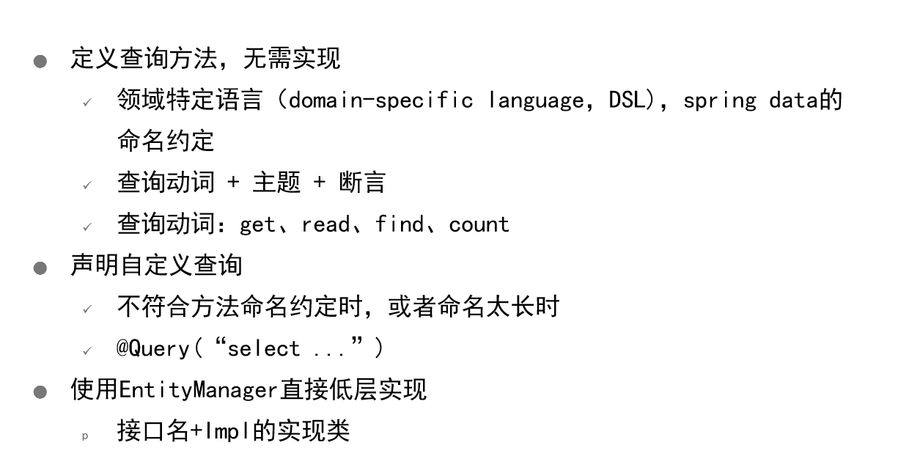

###### DSL命名约定

```java
public interface CargoRepository extends JpaRepository<Cargo, Long> {
    List<Cargo> findByCustomerIdOrderByOrderDateDesc(long customerId);
};
```

###### @Query自定义查询

```java
public interface CargoRepository extends JpaRepository<Cargo, Long>{
	@Query("select cg from Cargo cg order by cg.orderDate desc")
	List<Cargo> getThings();
};
```

###### Impl实现

- CargoRepository

```java
public interface CargoRepository extends JpaRepository<Cargo, Long>, CargoRepositoryCustom {
	@Query("select cg from Cargo cg order by cg.orderDate desc")
	List<Cargo> getThings();
};
```

- CargoRepositoryCustom (自定义的接口)

```java
public interface CargoRepositoryCustom {

    List<Cargo> findRecent();

    List<Cargo> findRecent(int count);
}
```

- CargoRepositoryImpl

```java
public class CargoRepositoryImpl implements CargoRepositoryCustom {
    //注意这个CargoRepositoryImpl不用继承CargoRepository接口，不过框架会自动将两个文件关联起来

    @PersistenceContext  //并不会真正注入EntityManager，因变它不是线程安全的
    private EntityManager entityManager;

    @Override
    public List<Cargo> findRecent() {
        return findRecent(10);
    }

    @Override
    public List<Cargo> findRecent(int count) {
        return (List<Cargo>) entityManager.createQuery("select cg from Cargo cg order by cg.orderDate desc")
                .setMaxResults(count).getResultList();
    }
}
```

##  服务端开发基本框架

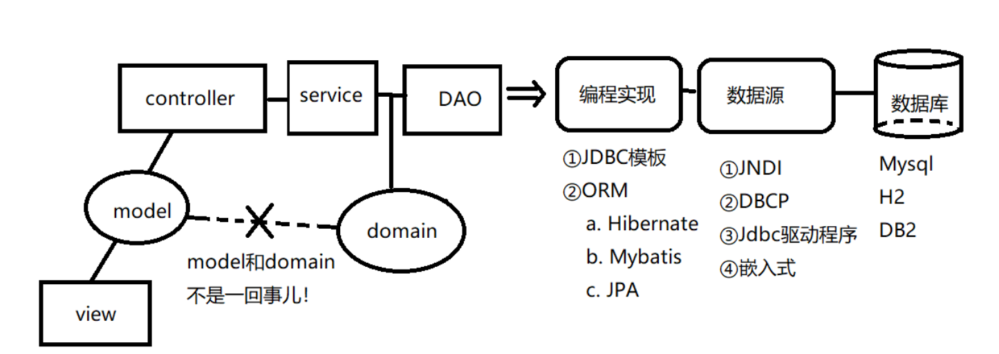


## 第8节 NoSQL数据库的使用和编程（MongoDB、Redis）

### 为什么需要非关系型数据库

- 有多个对象存在包含关系，如果使用关系型数据库需要建立多个表（Table），但是非关系型数据库可以存在一个文档（Document）里面
- 有些情况下不同记录可能包含不同字段，这时候只能用非关系型数据库

### 为什么要Redis

- 给经常使用的、不怎么变的数据做一个临时存储，储存在内存中，以便快速访问
- 集群之间的数据共享

### NoSQL


### MongoDB


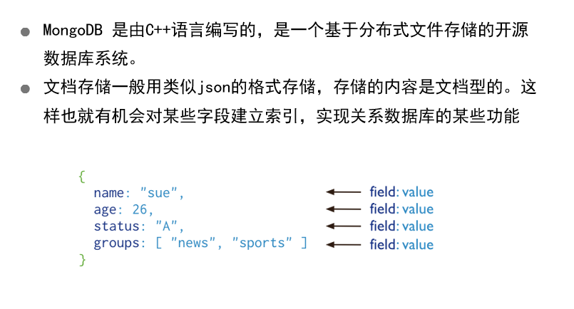

#### Docker运行MongoDB

```shell
docker run --name mymongo -d -p 27017:27017 mongo
docker stop mymongo
docker rm mymongo

# mongo访问
docker run -it --link mymongo:taozs --rm mongo mongo --host taozs


```

#### MongoDB Shell

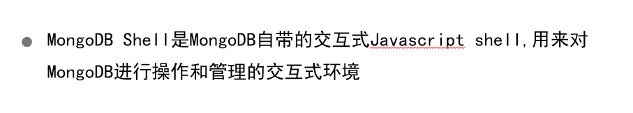

```shell
> var idObject =ObjectId()
> idObject.getTimestamp()
> idObject.str

show dbs
db
db.myCollection.insert({x:10})
db.myCollection.find()

```

#### MongoDB概念

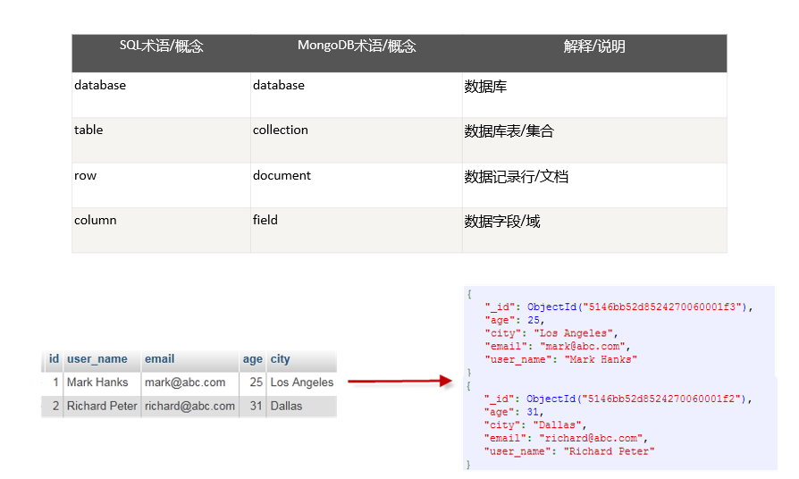

#### MongoDB 基本操作

```bash
show dbs #查看所有数据库名
db #查看当前数据库名
use 数据库名
db.dropDatabase()  删除数据库

db.createCollection("persons")
show collections

db.person.insert({name:'taozs',age:18})
db.person.find().pretty()
```

#### 代码部分

##### JDBC

###### java代码

```java
package customers.jdbc;

import com.mongodb.MongoClient;
import com.mongodb.client.FindIterable;
import com.mongodb.client.MongoCollection;
import com.mongodb.client.MongoCursor;
import com.mongodb.client.MongoDatabase;
import com.mongodb.client.model.Filters;
import org.bson.Document;

import java.util.ArrayList;
import java.util.List;

public class MongoDBJDBC {
    public static void main(String args[]) {
        try {
			//Addresss
            MongoClient mongoClient = new MongoClient("localhost", 27017);
            
			//Database
            MongoDatabase mongoDatabase = mongoClient.getDatabase("test");
            
			//Collection
            MongoCollection<Document> collection = mongoDatabase.getCollection("mytable"); 

            collection.deleteMany(Filters.eq("name", "taozs"));

            //插入
            Document document = new Document("name", "taozs").
                    append("age", 18).
                    append("memo", "taozhaosheng");

            List<Document> documents = new ArrayList<>();
            documents.add(document);
            collection.insertMany(documents);

            //删除符合条件的第一个文档
//            collection.deleteOne(Filters.eq("age", 18));

            //删除所有符合条件的文档
//            collection.deleteMany(Filters.eq("age", 18));

            //查询
            FindIterable<Document> findIterable = collection.find();

            MongoCursor<Document> mongoCursor = findIterable.iterator();
            while (mongoCursor.hasNext()) {
                Document doc =mongoCursor.next();
                System.out.println(doc);
                System.out.println(doc.toJson());
            }

            mongoClient.close();

        } catch (Exception e) {
            System.err.println(e.getClass().getName() + ": " + e.getMessage());
        }
    }
}

```

###### 需要的Maven依赖

```xml
<dependency>
    <groupId>org.mongodb</groupId>
    <artifactId>mongo-java-driver</artifactId>
    <version>3.12.2</version>
</dependency>
```


##### Spring Data

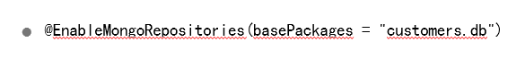

###### domain

```java
package customers;


import org.springframework.data.annotation.Id;
import org.springframework.data.mongodb.core.mapping.Document;
import org.springframework.data.mongodb.core.mapping.Field;

import java.util.Collection;
import java.util.LinkedHashSet;

@Document //注意和关系型数据库的 @Entity 区别
public class Customer {

    @Id
    private String id;

    @Field("name") //对应的集合的字段，注意和关系型数据库的 @Column 区别
    private String name;

    private String address; //如果类的字段和数据库集合的字段一样，可以省略 @Field

    private Collection<Cargo> cargos = new LinkedHashSet<>();
  	
    ...
}

```

###### 配置

```java
package customers.config;

import com.mongodb.MongoClient;
import org.springframework.context.annotation.Configuration;
import org.springframework.data.mongodb.config.AbstractMongoConfiguration;
import org.springframework.data.mongodb.repository.config.EnableMongoRepositories;

@Configuration
@EnableMongoRepositories(basePackages = {"customers.db", "person"}) //指定Repository接口所在的包名
public class MongoConfig extends AbstractMongoConfiguration {

    @Override
    protected String getDatabaseName() {
        return "customerdb";
    } //数据库名字

    @Override
    public MongoClient mongo() throws Exception {
        return new MongoClient(); //mongo客户端，可以在此设置IP端口之类的，默认为 127.0.0.1:27017
    }

}
```

###### Repository

```java
package customers.db;

import customers.Customer;
import org.springframework.data.mongodb.repository.MongoRepository;
import org.springframework.data.mongodb.repository.Query;

import java.util.List;

public interface CustomerRepository extends MongoRepository<Customer, String> {

    List<Customer> findByName(String name);

    List<Customer> findByNameLike(String name);

    List<Customer> findByNameAndCity(String name, String city);

    List<Customer> getByCity(String city);

    @Query("{email:'tzs@163.com'}")
    List<Customer> findTaoCustomer();

}

```

- 同样的，SpringData帮忙提供了save、delete等实现
- JPA · SpringData里面所讲的**DSL命名约定** 和 **@Query自定义查询**同样适用于SpringDataMongoDB
- 向数据库插入数据的时候，SpringData会带上java class的信息（jdbc不会）
- SpringData插入数据的效率比jdbc慢

###### faker

- 用于模拟数据

```java
package customers;

import com.github.javafaker.Faker;
import org.junit.Test;

import java.util.Locale;

public class FakerTest {

    @Test
    public void fakerTest() {
        Faker faker = new Faker(Locale.CHINA);

        System.out.println(faker.address().streetAddress());

        System.out.println(faker.name().fullName());

        System.out.println(faker.book().title());

        System.out.println(faker.phoneNumber().cellPhone());

        System.out.println(faker.app().name());

        System.out.println(faker.color().name());

        System.out.println(faker.date().birthday());

        System.out.println(faker.idNumber().invalid());
    }
}

```

### Redis

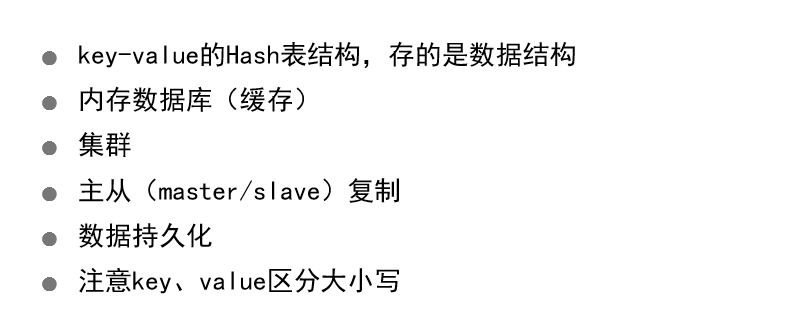


#### Redis的启动和访问

- docker启动

```bash
docker run -d --name myredis -p 6379:6379 redis
docker run -it --rm --link myredis:taozs redis redis-cli -h taozs
```

- 常用语法

```bash
keys * #获取所有key
set key value 
get key
set counter 100
incr counter
incrby counter 50
decr
decrby
mset a 10 b 20 c 30 #给多个key赋值
mget a b c #获取多个key的值
exists key
del key
type key
expire key 5 #设置过期时间
set a 111 ex 5
ttl key #查看剩余时间
```

#### Redis数据类型

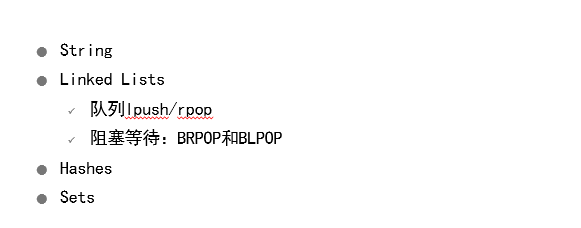

```bash
rpush mylist 15
lrange mylist 0 -1    #-1是列表的最后一个元素，-2是列表的倒数第二个元素，依此类推。
rpush mylist 1 2 3 4 5 "foo bar" #从右边push
lpush mylist 1 2 3 4 5 #从左边push
rpop key
lpop key
brpop tasks 5 #list没有元素的时候可以等待，这里5表示等五秒钟
 
hmset user name tao age 10 #给叫做user的hash表提供(name,tao) 和 (age,10)键值
hgetall user
hget user name
 
sadd myset 1 2 3 #设置集合元素
smembers myset #获取集合元素

```

- 数字其实也是字符串类型，但是在做运算的时候还是按照数值运算的

#### 代码解析

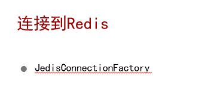

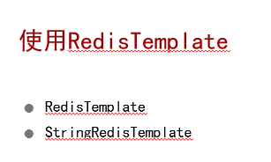

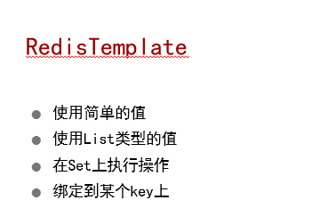

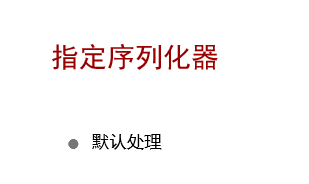


##### maven依赖

```xml
<dependency>
    <groupId>redis.clients</groupId>
    <artifactId>jedis</artifactId>
    <version>2.5.2</version>
</dependency>

<dependency>
    <groupId>org.springframework.data</groupId>
    <artifactId>spring-data-redis</artifactId>
    <version>1.3.2.RELEASE</version>
</dependency>
```

##### Config

```java
package cargo;

import org.springframework.context.annotation.Bean;
import org.springframework.context.annotation.Configuration;
import org.springframework.data.redis.connection.RedisConnectionFactory;
import org.springframework.data.redis.connection.jedis.JedisConnectionFactory;
import org.springframework.data.redis.core.RedisTemplate;

@Configuration
public class RedisConfig {

    @Bean
    public RedisConnectionFactory redisCF() {
        return new JedisConnectionFactory(); //这里可以指定端口号之类的
    }

    @Bean
    public RedisTemplate<Integer, Cargo> redisTemplate(RedisConnectionFactory cf) {
        RedisTemplate<Integer, Cargo> redis = new RedisTemplate<>();
        redis.setConnectionFactory(cf);
        return redis;
    }

}

```

##### redis的使用

- opsForValue
- opsForList
- opsForSet

```java
package cargo;

import org.junit.Before;
import org.junit.Test;
import org.junit.runner.RunWith;
import org.springframework.beans.factory.annotation.Autowired;
import org.springframework.data.redis.connection.RedisConnectionFactory;
import org.springframework.data.redis.core.BoundListOperations;
import org.springframework.data.redis.core.RedisTemplate;
import org.springframework.data.redis.core.StringRedisTemplate;
import org.springframework.data.redis.serializer.Jackson2JsonRedisSerializer;
import org.springframework.data.redis.serializer.StringRedisSerializer;
import org.springframework.test.context.ContextConfiguration;
import org.springframework.test.context.junit4.SpringJUnit4ClassRunner;

import java.sql.Date;
import java.util.List;

import static org.junit.Assert.assertEquals;

@RunWith(SpringJUnit4ClassRunner.class)
@ContextConfiguration(classes = RedisConfig.class)
public class CargoTest {

    @Autowired
    private RedisConnectionFactory cf;

    @Autowired
    private RedisTemplate<Integer, Cargo> redis; //注入redisTemplate

    @Before
    public void cleanUp() {
        redis.delete(1);
        redis.delete(10);
        redis.delete(11);
        redis.delete(12);
        redis.delete(13);
    }

    //ValueOperations接口
    @Test
    public void workingWithSimpleValues() {
        Cargo cargo1 = new Cargo();
        cargo1.setId(1);
        cargo1.setProduct("computer");
        cargo1.setQuantity(2);
        cargo1.setOrderDate(Date.valueOf("2019-09-19"));

        redis.opsForValue().set(cargo1.getId(), cargo1); //会被序列化 

        Cargo found = redis.opsForValue().get(cargo1.getId());
        assertEquals(cargo1.getProduct(), found.getProduct());
        assertEquals(cargo1.getQuantity(), found.getQuantity());
        assertEquals(cargo1.getOrderDate(), found.getOrderDate());
    }

    //ListOperations
    @Test
    public void workingWithLists() {
        Cargo cargo1 = new Cargo();
        cargo1.setId(1);
        cargo1.setProduct("computer");
        cargo1.setQuantity(2);
        cargo1.setOrderDate(Date.valueOf("2019-09-19"));

        Cargo cargo2 = new Cargo();
        cargo2.setId(2);
        cargo2.setProduct("phone");
        cargo2.setQuantity(4);
        cargo2.setOrderDate(Date.valueOf("2012-10-11"));

        Cargo cargo3 = new Cargo();
        cargo3.setId(3);
        cargo3.setProduct("ipad");
        cargo3.setQuantity(6);
        cargo3.setOrderDate(Date.valueOf("2020-03-18"));

        redis.opsForList().rightPush(10, cargo1); //列表数据结构，也会被序列化
        redis.opsForList().rightPush(10, cargo2);
        redis.opsForList().rightPush(10, cargo3);

        assertEquals(3, redis.opsForList().size(10).longValue());
    }

    //SetOperations
    @Test
    public void performingOperationsOnSets() {
        Cargo cargo1 = new Cargo();
        cargo1.setId(1);
        cargo1.setProduct("computer");
        cargo1.setQuantity(2);
        cargo1.setOrderDate(Date.valueOf("2019-09-19"));

        redis.opsForSet().add(12, cargo1);
        assertEquals(1, redis.opsForSet().size(12).longValue());
    }

    //BoundListOperations， 提前设置好要查询的key的名字
    @Test
    public void bindingToAKey() {
        Cargo cargo1 = new Cargo();
        cargo1.setId(1);
        cargo1.setProduct("computer");
        cargo1.setQuantity(2);
        cargo1.setOrderDate(Date.valueOf("2019-09-19"));

        Cargo cargo2 = new Cargo();
        cargo2.setId(2);
        cargo2.setProduct("phone");
        cargo2.setQuantity(4);
        cargo2.setOrderDate(Date.valueOf("2012-10-11"));

        Cargo cargo3 = new Cargo();
        cargo3.setId(3);
        cargo3.setProduct("ipad");
        cargo3.setQuantity(6);
        cargo3.setOrderDate(Date.valueOf("2020-03-18"));

        BoundListOperations<Integer, Cargo> cargos = redis.boundListOps(13);
        cargos.rightPush(cargo1);
        cargos.rightPush(cargo2);
        cargos.rightPush(cargo3);

        assertEquals(3, cargos.size().longValue());

        Cargo first = cargos.leftPop();
        Cargo last = cargos.rightPop();

        assertEquals(cargo1.getProduct(), first.getProduct());
        assertEquals(cargo1.getQuantity(), first.getQuantity());
        assertEquals(cargo1.getOrderDate(), first.getOrderDate());

        assertEquals(cargo3.getProduct(), last.getProduct());
        assertEquals(cargo3.getQuantity(), last.getQuantity());
        assertEquals(cargo3.getOrderDate(), last.getOrderDate());

        assertEquals(1, cargos.size().longValue());
    }

    @Test
    public void settingKeyAndValueSerializers() {//设置第三方的序列化模块
        RedisTemplate<String, Cargo> redis = new RedisTemplate();
        redis.setConnectionFactory(cf);
        redis.setKeySerializer(new StringRedisSerializer());
        redis.setValueSerializer(new Jackson2JsonRedisSerializer<>(Cargo.class));//序列化为json格式
        redis.afterPropertiesSet();

        Cargo cargo1 = new Cargo();
        cargo1.setId(1);
        cargo1.setProduct("computer");
        cargo1.setQuantity(2);
        cargo1.setOrderDate(Date.valueOf("2019-09-19"));

        redis.opsForValue().set(cargo1.getId().toString(), cargo1);

        Cargo found = redis.opsForValue().get(cargo1.getId().toString());
        assertEquals(cargo1.getProduct(), found.getProduct());
        assertEquals(cargo1.getQuantity(), found.getQuantity());

		StringRedisTemplate stringRedis = new StringRedisTemplate(cf);
		String json = stringRedis.opsForValue().get(cargo1.getId().toString());
		assertEquals("{\"id\":1,\"product\":\"computer\",\"quantity\":2,\"orderDate\":\"2019-09-19\"}", json);

    }
}

```


## 第9节 缓存编程

### PPT一览

#### 启用缓存

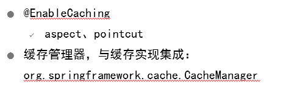

#### 缓存实现（底层缓存供应商）


#### EhCache原生使用

```java
package com.example.db.jdbc;

import com.example.domain.Customer;
import net.sf.ehcache.Cache;
import net.sf.ehcache.CacheManager;
import net.sf.ehcache.Element;
import org.junit.Test;

public class OriginalEhCacheTest {

    @Test
    public void test1() {
        // 1. 创建缓存管理器
        CacheManager cacheManager = CacheManager.create("src/main/resources/com/example/cache/hellocache.xml");

        // 2. 获取缓存对象
        Cache cache = cacheManager.getCache("HelloWorldCache");

        // 3. 创建元素
        Element element1 = new Element("key1", "value1");

        // 4. 将元素添加到缓存
        cache.put(element1);

        // 5. 获取缓存
        Element element2 = cache.get("key1");
        System.out.println(element2);
        System.out.println(element2.getObjectValue());

        // 6. 删除元素
//        cache.remove("key1");

        Customer customer1 = new Customer(1L, "zhangsan", "address1", "nanjing",
                "zhangsan@163.com");
        Element celement = new Element("zhangsan", customer1);
        cache.put(celement);
        Element customer2 = cache.get("zhangsan");
        System.out.println(customer2);
        System.out.println(customer2.getObjectValue());

        System.out.println(cache.getSize());

        // 7. 刷新缓存，持久化到硬盘
        cache.flush();

        // 8. 关闭缓存管理器
        cacheManager.shutdown();

    }

}

```


#### EhCache概念

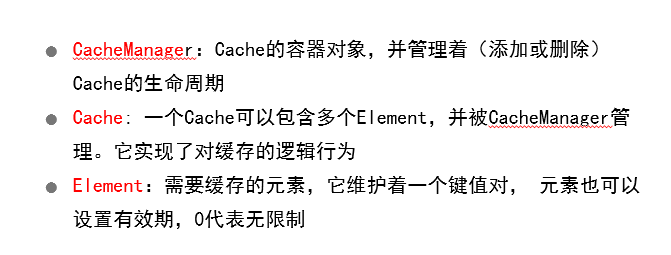

#### 自定义缓存配置

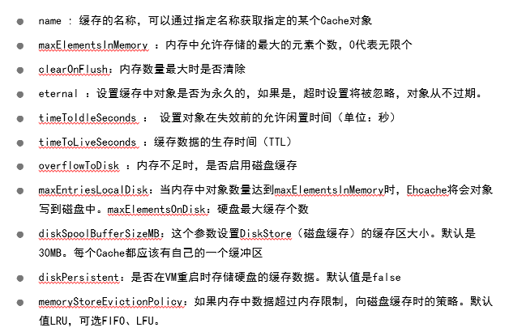

#### Spring与EhCache集成

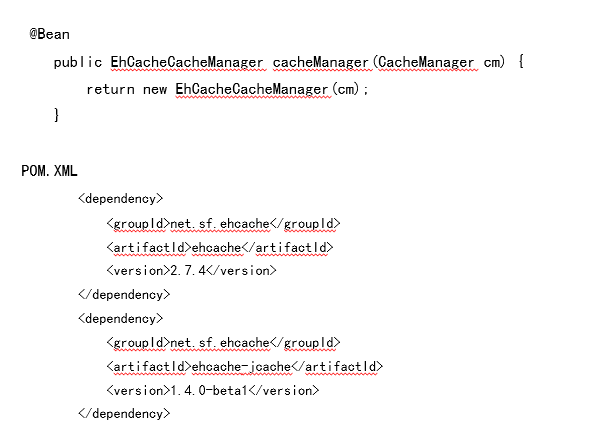

#### Spring与Redis集成


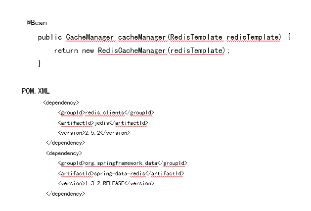

#### 注解

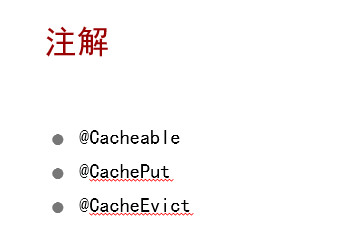

#### 自定义缓存key

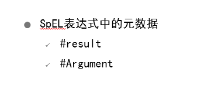

#### 条件化缓存key

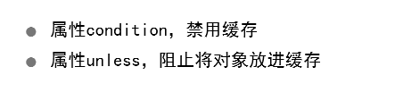

#### 移除缓存项


### 代码一览

#### 配置

##### Spring自带的cache

```java
import org.springframework.cache.CacheManager;
import ...;

@Configuration
@EnableCaching //使用缓存
public class CachingConfig {
    @Bean
    public CacheManager cacheManager() {
        return new ConcurrentMapCacheManager();
    }
}
```

##### EhCache

- CachingConfig

```java
import net.sf.ehcache.CacheManager;
import org.springframework.cache.ehcache.EhCacheCacheManager;
import org.springframework.cache.ehcache.EhCacheManagerFactoryBean;
import ...;

@Configuration
@EnableCaching
public class CachingConfig {
    @Bean
    public EhCacheCacheManager cacheManager(CacheManager cm) {
        return new EhCacheCacheManager(cm);
    }

    @Bean
    public EhCacheManagerFactoryBean ehcache() { //spring内部通过 EhCacheManagerFactoryBean 创建CacheManager并注入上面的函数
        EhCacheManagerFactoryBean ehCacheFactoryBean =
            new EhCacheManagerFactoryBean();
        ehCacheFactoryBean.setConfigLocation(
            new ClassPathResource("com/example/cache/hellocache.xml"));
        return ehCacheFactoryBean;
    }
}
```

- com/example/cache/hellocache.xml

```xml
<?xml version="1.0" encoding="UTF-8"?>
<ehcache xmlns:xsi="http://www.w3.org/2001/XMLSchema-instance"
         xsi:noNamespaceSchemaLocation="http://ehcache.org/ehcache.xsd">

    <!-- 磁盘缓存位置 -->
    <diskStore path="c:/ehcache"/>

    <!-- 默认缓存 -->
    <defaultCache
            maxEntriesLocalHeap="10000"
            eternal="false"
            timeToIdleSeconds="120"
            timeToLiveSeconds="120"
            maxEntriesLocalDisk="10000000"
            diskExpiryThreadIntervalSeconds="120"
            memoryStoreEvictionPolicy="LRU">
        <persistence strategy="localTempSwap"/>
    </defaultCache>

    <!-- helloworld缓存 -->
    <cache name="HelloWorldCache"
           maxElementsInMemory="1"
           eternal="true"
           timeToIdleSeconds="5"
           timeToLiveSeconds="5"
           overflowToDisk="false"
           diskPersistent="true"
           memoryStoreEvictionPolicy="LRU"/>
    <cache name="cargoCache"
           maxBytesLocalHeap="50m"
           timeToLiveSeconds="100">
    </cache>
</ehcache>

```

##### RedisCache

```java
import org.springframework.data.redis.cache.RedisCacheManager;
import org.springframework.data.redis.connection.RedisConnectionFactory;
import org.springframework.data.redis.connection.jedis.JedisConnectionFactory;
import org.springframework.data.redis.core.RedisTemplate;
import ...;

@Configuration
@EnableCaching
public class CachingConfig {
    @Bean
    public CacheManager cacheManager(RedisTemplate redisTemplate) {
        return new RedisCacheManager(redisTemplate);
    }

    //创建redis连接
    @Bean
    public RedisConnectionFactory redisCF() {
        return new JedisConnectionFactory();
    }

    @Bean
    public RedisTemplate<String, String> redisTemplate(RedisConnectionFactory cf) {
        RedisTemplate<String, String> redis = new RedisTemplate<>();
        redis.setConnectionFactory(cf);
        return redis;
    }
}
```

#### 使用方式

```java
package com.example.db;

import com.example.domain.Cargo;
import org.springframework.cache.annotation.CacheEvict;
import org.springframework.cache.annotation.CachePut;
import org.springframework.cache.annotation.Cacheable;

import java.util.List;

public interface CargoRepository {
    long count();

    @Cacheable("cargoCache") //指定Cache名字
    List<Cargo> findRecent();

    List<Cargo> findRecent(int count);

    @Cacheable("cargoCache")
    Cargo findOne(long id);

    @CachePut(value = "cargoCache", key = "#result.id") //储存之后将返回的Cargo对象缓存起来，将返回的Cargo对象的id作为key (如果使用参数的某字段作为key，则这样写 —— (key = "#cargo.name"))
    Cargo save(Cargo cargo);

    @Cacheable("cargoCache")
    List<Cargo> findByCustomerId(long customerId);

    @CacheEvict(value = "cargoCache")//执行之后删除缓存
    void delete(long id);

    List<Cargo> findAll();
}

```

### 其他

#### EhCache与Redis对比

- EhCache和当前程序运行在同一个进程空间内，跑在相同的java虚拟机上面，速度很快；EhCache能做一些定制化的配置，比如允许缓存在磁盘上等等
- Redis能应对分布式的场景，速度相较于EhCache略慢

#### 为什么需要缓存技术？

- 可能经常访问某个远程数据库，每次都进行查询效率比较低
- 可能某服务需要执行耗时的计算，每次计算结果都一样，那可以将这个计算结果缓存起来，方便快速访问


## 中期总结

- 见 2020-服务端开发-第9节.pptx


## 第10节 容器、Docker使用

### docker初探

#### docker简单示意图

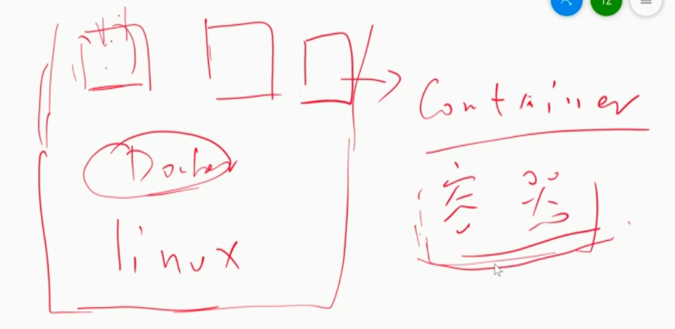

#### docker与虚拟机的架构对比

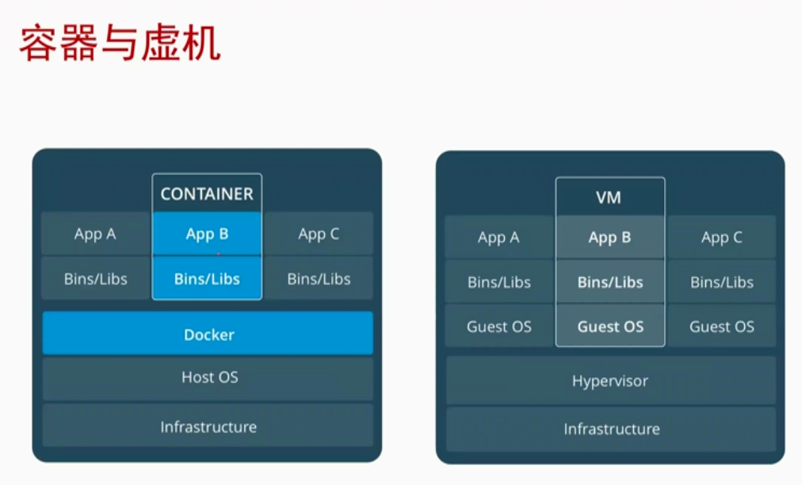

#### docker的组成

- docker engine（docker daemon）
- docker client
- docker 仓库（docker registries）


#### windows docker架构示意图

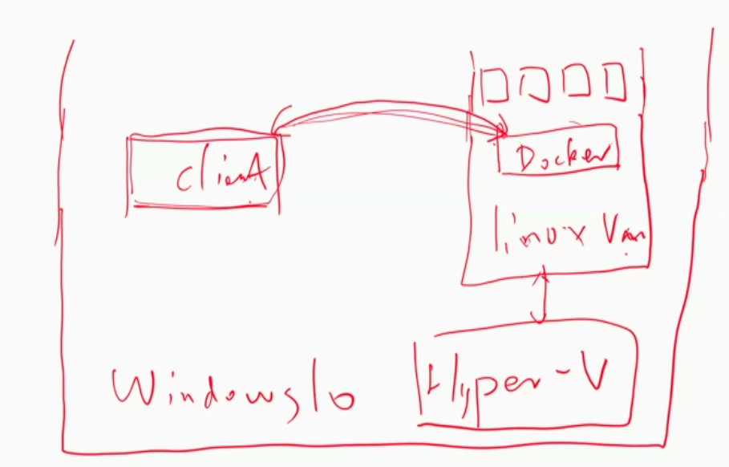


### 什么是容器

容器是另外一种轻量级的虚拟化，容器是共用主机内核，利用内核的虚拟化技术隔离出一个独立的运行环境，拥有独立的一个文件系统，网络空间，进程空间视图等。

### 虚拟机与容器的对比

● 容器是在Linux内核实现的轻量级资源隔离机制

● 虚拟机是操作系统级别的资源隔离，容器本质上是进程级的资源隔离

### Docker 命令

#### 基本命令

```bash
docker # 总的help
docker container –help #针对container的help
docker --version # 版本
docker version # 详细版本信息
docker info # docker信息，比如当前有多少个容器在运行、CPU和内存资源等等
docker image ls # 查看所有镜像
docker pull # 拉取镜像
```

#### docker run

```bash
docker run hello-world
-d # 后台运行容器，并返回容器ID
-i # 以交互模式运行容器，通常与 -t 同时使用
-t # 为容器重新分配一个伪输入终端，通常与 -i 同时使用
-p # 指定（发布）端口映射，格式为：(主机(宿主)端口:容器端口)
-P # 随机端口映射，容器内部端口随机映射到主机的高端口
--name="nginx-lb" # 为容器指定一个名称
-e username="ritchie" #  设置环境变量
--env-file=c:/temp1/t.txt #  从指定文件读入环境变量
--expose=2000-2002 #  开放（暴露）一个端口或一组端口；
--link my-mysql:taozs  # 添加链接到另一个容器 (容器原名:容器别名)
-v  c:/temp1:/data #  绑定一个卷(volume) (主机目录:容器目录)
-w /data # 指定进入容器后的工作目录
--rm   # 退出时自动删除容器
```

#### docker container

```bash
docker container ls # 等价于 docker ps，列出正在run的容器
docker container ls -a # 等价于 docker ps -a，列出所有容器
docker container ls –aq # 列出所有容器的id
docker inspect 容器名 # 显示容器信息
docker port 容器名 # 显示端口映射信息
docker logs -f <容器 ID> # 查看容器内部的标准输出
docker stop <容器 ID> #  停止一个容器
docker start <容器 ID> # 启动已停止运行的容器
docker restart <容器 ID> # 正在运行的容器可以重启
docker attach <容器 ID>  # 附着到容器
docker exec -it <容器 ID> /bin/bash # 进入容器，执行命令
docker rm -f   <容器 ID> # 删除容器
docker container prune # 清理掉所有处于终止状态的容器
```

#### 几个练习

##### GCC

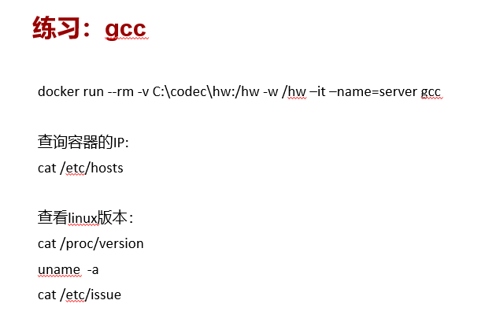

##### MongoDB

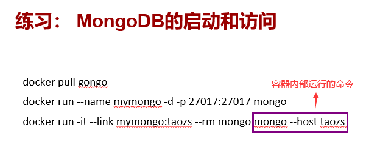

##### Redis


##### Mysql

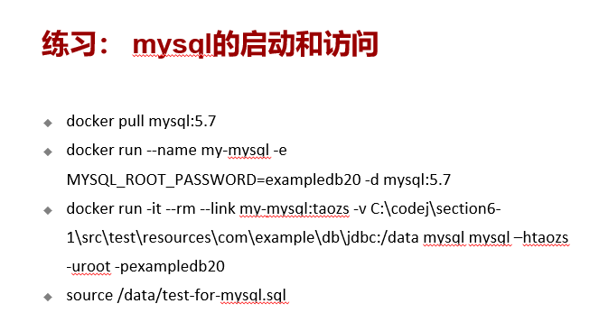

- pull 镜像
- 后台启动mysql 服务（设置root密码）
- 新开一个mysql服务，挂载数据卷（sql所在文件夹），开启mysql客户端，连接到上一步创建的mysql服务
- 执行sql代码

```bash
# 方式一
docker pull mysql:5.7
docker run --name my-mysql -e MYSQL_ROOT_PASSWORD=exampledb20 -d mysql:5.7
docker run -it --rm --link my-mysql:taozs -v C:\codej\section6-1\src\test\resources\com\example\db\jdbc:/data mysql mysql –htaozs -uroot -pexampledb20
source /data/test-for-mysql.sql 

# 方式二（只需要启用一个容器）
## 绑定挂载卷 （自定义要挂载的目录
docker run --name my-mysql  -v c:/temp2:/var/lib/mysql -e MYSQL_ROOT_PASSWORD=exampledb20 -d mysql:5.7
## docker管理卷 （docker管理挂载卷，我们只需要知道卷的名字就可以使用
docker volume create mysql-volume
docker run --name my-mysql  -v mysql-volume:/var/lib/mysql -e MYSQL_ROOT_PASSWORD=exampledb20 -d mysql:5.7

# 开一个mysql客户端
docker run -it --rm --link my-mysql:taozs mysql mysql –htaozs -uroot -pexampledb20
```


#### 镜像分层

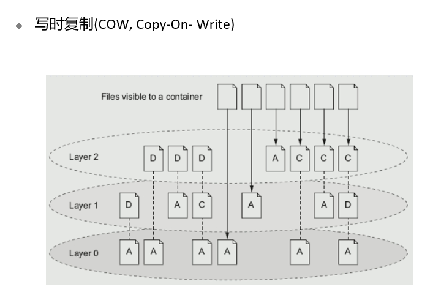

最上层可读写，下面的只读

#### 数据卷

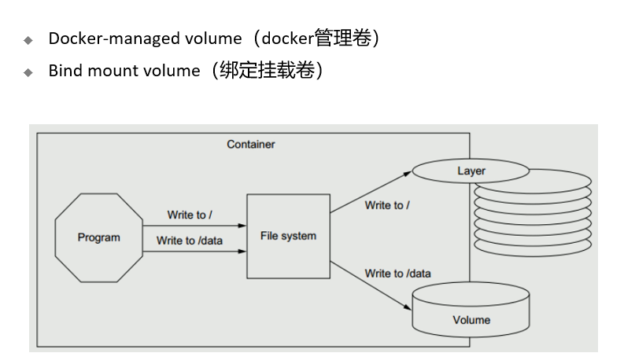

```bash
volumes：Docker管理宿主机文件系统的一部分，默认位于 /var/lib/docker/volumes 目录中
bind mounts：意味着可以存储在宿主机系统的任意位置
tmpfs：挂载存储在宿主机系统的内存中，而不会写入宿主机的文件系统

# docker volume create edc-nginx-vol // 创建一个自定义容器卷 
# docker volume ls // 查看所有容器卷
# docker volume inspect edc-nginx-vol // 查看指定容器卷详情信息
docker inspect -f {{.Mounts}} b1
#docker volume rm edc-nginx-vol // 删除自定义数据卷

创建使用指定卷的容器
docker run -d --name=edc-nginx -p 8800:80 -v edc-nginx-vol:/usr/share/nginx/html nginx   注意：-v 后面只有一个目录名，则指的是在容器中目录，然后会自动创建一个volume与它对应。如果edc-nginx-vol不存在，则会自动创建一个volume
docker run -d  --name=edc-nginx -v /app/wwwroot:/usr/share/nginx/html nginx

docker rm -v 命令在删除容器时删除该容器的卷
docker volume prune

docker cp c:/temp1 first:/data    在主机与容器之间COPY
docker cp first:/data  /tmp

```

#### 导入导出容器镜像

```bash
docker export 1e560fca3906 > ubuntu.tar
#导出容器 1e560fca3906 快照到本地文件 ubuntu.tar
docker import ubuntu.tar test/ubuntu:v1
#将快照文件 ubuntu.tar 导入到镜像 test/ubuntu:v1

docker import http://example.com/exampleimage.tgz example/imagerepo
```

- 注意针对容器导出，然后导入到镜像

#### 容器网络

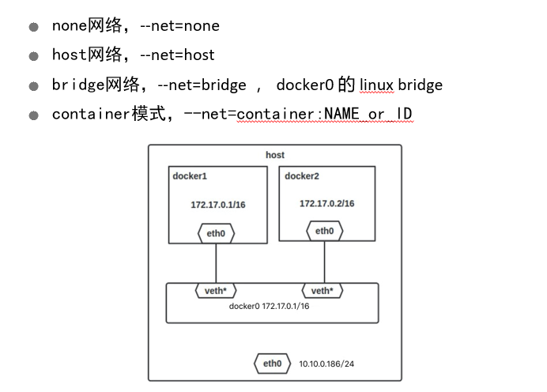

- none -- 没有网络
- host -- 和主机共享网络，网络设备信息跟主机一样
- bridge -- 桥接模式，如图，docker1、docker2和docker0可以互相ping通
- container -- 和容器共享网络

```bash
connect  NETWORK CONTAINER    	#Connect a container to a network
create      					#Create a network
disconnect  NETWORK CONTAINER  	#Disconnect a container from a network
inspect     					#Display detailed information on one or more networks
ls          					#List networks
prune       					#Remove all unused networks
rm          					#Remove one or more networks
```

##### 例子

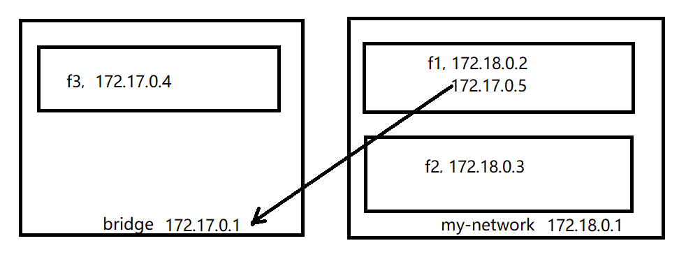

docker f1--IP : 172.18.0.2，172.17.0.5，网关： 172.18.0.1，172.17.0.1

```bash
docker run --rm -it --net my-network --name f1 busybox
docker network connect bridge f1
```

docker f2--IP : 172.18.0.3，网关： 172.18.0.1

```bash
docker run --rm -it --net my-network --name f2 busybox
```

docker f3--IP : 172.17.0.4，网关： 172.17.0.1

```bash
docker run --rm -it --name f3 busybox
```


## 第11节 微服务概念、SpringBoot开发微服务


## 第12节 配置服务


## 第13节 服务发现


## 第14节 熔断和容错


## 第15节 服务路由


## 第16节 Kubernates、服务编排、服务部署、Service Mesh